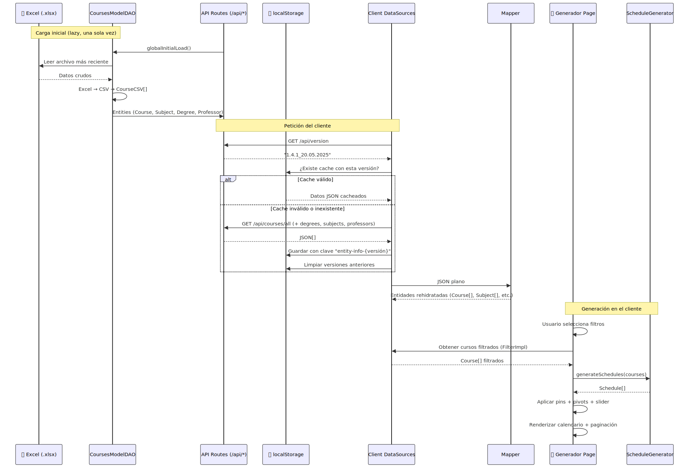

# Arquitectura del Proyecto Kiin

**Kiin** (K'iin — "tiempo" en maya) es una aplicación web construida con **Next.js 15** que permite a estudiantes de la **Facultad de Matemáticas de la UADY** (Universidad Autónoma de Yucatán) generar, comparar, fijar y exportar horarios académicos libres de conflictos.

La aplicación lee datos académicos desde archivos Excel proporcionados por la facultad, los expone a través de una API REST, y ejecuta un algoritmo combinatorio **en el navegador del usuario** para generar todas las combinaciones válidas de horarios sin solapamientos.

---

## Stack Tecnológico

| Categoría         | Tecnología              | Uso                                                    |
| ----------------- | ----------------------- | ------------------------------------------------------ |
| **Framework**     | Next.js 15              | App Router (páginas/layouts) + Pages Router (API REST) |
| **Lenguaje**      | TypeScript              | Tipado estricto en todas las capas                     |
| **Estilos**       | TailwindCSS             | Utilidades CSS, modo claro/oscuro                      |
| **UI Components** | HeroUI, Framer Motion   | Slider, spinner, animaciones de transición             |
| **Calendario**    | FullCalendar (timeGrid) | Visualización semanal de horarios                      |
| **Datos**         | ExcelJS + csv-parser    | Lectura y parseo de archivos `.xlsx` en el servidor    |
| **Autenticación** | Supabase (OAuth)        | Flujo popup de Google para exportar a Google Calendar  |
| **Modales**       | SweetAlert2             | Diálogos de confirmación, error y resumen              |
| **Partículas**    | tsparticles             | Efecto visual en la página de inicio                   |
| **Fechas**        | Moment.js (UTC)         | Manejo de horas de sesiones académicas                 |
| **Analytics**     | Vercel Analytics        | Métricas de uso                                        |
| **Monetización**  | Google AdSense          | Banners publicitarios                                  |
| **Despliegue**    | Vercel                  | Hosting con funciones serverless para API              |

---

## Estructura de Directorios

```
src/
├── app/                        # Capa de Presentación (App Router, Next.js 15)
│   ├── layout.tsx              # Layout raíz (SupabaseProvider + NavBar)
│   ├── page.tsx                # Punto de entrada → HomeContent
│   ├── HomeContent.tsx         # Landing page (typewriter + partículas + CTA)
│   ├── globals.css             # Variables CSS, scrollbar, animaciones
│   ├── components/             # Componentes React reutilizables
│   │   ├── Calendar.tsx        # Calendario semanal (FullCalendar timeGrid)
│   │   ├── CategorySelector.tsx# Acordeón individual de una categoría de filtro
│   │   ├── FilterSelector.tsx  # Panel completo de filtros (Carrera + Semestres)
│   │   ├── SideBar.tsx         # Overlay lateral animado para filtros
│   │   ├── SliderBar.tsx       # Control slider de materias por horario
│   │   ├── Pagination.tsx      # Controles anterior/siguiente de horarios
│   │   ├── NavBar.tsx          # Barra de navegación responsiva
│   │   ├── GoogleCalendarButton.tsx  # Exportación OAuth → Google Calendar
│   │   ├── ICSButton.tsx       # Exportación a archivo .ics descargable
│   │   ├── UpdateIndicator.tsx # Punto verde pulsante + fecha de datos
│   │   ├── FloatingWhatsAppButton.tsx # CTA flotante de WhatsApp
│   │   ├── SupabaseProvider.tsx# Context provider de Supabase + aviso dev
│   │   ├── AdBanner.tsx        # Banner de Google AdSense
│   │   ├── AdSense.tsx         # Script global de AdSense
│   │   ├── Particles.tsx       # Configuración de tsparticles
│   │   ├── ParticlesContainer.tsx # Wrapper posicional de partículas
│   │   └── TemporaryForm.tsx   # Formulario para agregar clase temporal
│   ├── widgets/                # Vistas compuestas principales
│   │   ├── SubjectsView.tsx    # Panel izquierdo: materias + pin + profesores
│   │   ├── SchedulesView.tsx   # Panel central: calendario + slider + paginación
│   │   └── CurrentSchedule.tsx # Panel derecho: detalle + compartir + exportar
│   ├── generador/
│   │   ├── page.tsx            # Página principal del generador de horarios
│   │   └── horario/
│   │       ├── page.tsx        # Wrapper con Suspense para horario compartido
│   │       └── HorarioClient.tsx # Vista de horario compartido (solo lectura)
│   ├── contact/page.tsx        # Página del equipo (Core + Otros)
│   ├── faq/page.tsx            # Preguntas frecuentes (acordeón)
│   └── motivation/page.tsx     # Página de motivación e historia
│
├── domain/                     # Capa de Dominio (entidades + interfaces)
│   ├── entities/               # Entidades y lógica de negocio
│   │   ├── Course.ts           # Curso: materia + profesor + sesiones + grupo
│   │   ├── Subject.ts          # Materia: semestres[], carreras[], créditos
│   │   ├── Professor.ts        # Profesor: nombres + apellidos + fullName
│   │   ├── Degree.ts           # Carrera: nombre + lista de materias
│   │   ├── Session.ts          # Sesión: día + hora inicio/fin (Moment) + aula
│   │   ├── Schedule.ts         # Horario: cursos + incompatibles + sync auto
│   │   ├── ScheduleGenerator.ts# ★ Algoritmo core de generación combinatoria
│   │   ├── Pivot.ts            # Interfaz materia-profesor (fijación)
│   │   ├── Filter.ts           # Interfaz de filtro de alto nivel
│   │   ├── CourseFilter.ts     # Interfaz Strategy: satify(course): boolean
│   │   ├── Category.ts         # Interfaz de categoría (UI + filtro)
│   │   ├── DynamicCategory.ts  # Base abstracta para categorías dinámicas
│   │   ├── DegreeFilter.ts / DegreeCategory.ts
│   │   ├── SemesterFilter.ts / SemesterCategory.ts
│   │   ├── SubjectFilter.ts / SubjectCategory.ts     # (dinámica)
│   │   ├── ProfessorFilter.ts / ProfessorCategory.ts # (dinámica)
│   │   ├── ModalityFilter.ts / ModalityCategory.ts
│   │   ├── GroupFilter.ts / GroupCategory.ts
│   │   ├── Day.ts              # Enum: MONDAY..SUNDAY
│   │   ├── SubjectType.ts      # Enum: MANDATORY, OPTATIVE, PROPED
│   │   ├── Modalities.ts       # Enum: Regular, Acompañamiento
│   │   └── Group.ts            # Enum: First=1, Second=2, Third=3
│   ├── datasources/            # Interfaces de fuentes de datos
│   │   ├── CoursesDataSource.ts
│   │   ├── DegreesDataSource.ts
│   │   ├── ProfessorsDataSource.ts
│   │   └── SubjectsDataSource.ts
│   ├── repositories/           # Interfaces de repositorios
│   │   ├── CoursesRepository.ts
│   │   ├── DegreesRepositors.ts
│   │   ├── ProfessorsRepository.ts
│   │   └── SubjectsRepository.ts
│   └── use_cases/
│       └── ScheduleUseCase.ts  # Stub (sin implementar)
│
├── infrastructure/             # Capa de Infraestructura (implementaciones)
│   ├── datasource/             # DataSources del lado del cliente
│   │   ├── CoursesCsvDatasource.ts   # Fetch API + cache localStorage
│   │   ├── DegreesCsvDataSource.ts
│   │   ├── ProfessorsCsvDataSource.ts
│   │   ├── SubjectsCSvDataSource.ts
│   │   └── FilterImpl.ts            # Implementación: DegreeFilter + SubjectFilter
│   ├── repositories/           # Implementaciones Repository (delegación)
│   │   ├── CoursesRepositoryImpl.ts
│   │   ├── DegreesRepositoryImpl.ts
│   │   ├── ProfessorsRepositoryImpl.ts
│   │   └── SubjectsRepositoryImpl.ts
│   └── mappers/
│       └── Mapper.ts           # Rehidratación JSON → clases de dominio
│
├── lib/data/                   # Capa de Datos del servidor
│   ├── CourseModel.ts          # Interfaz CourseCSV (fila del Excel)
│   ├── CoursesModelDAO.ts      # DAO: lectura Excel → CSV → CourseCSV[]
│   ├── CourseMapper.ts         # Servidor: CourseCSV → Course entity
│   ├── SubjectMapper.ts        # Servidor: CourseCSV → Subject entity
│   └── initialLoad.ts         # Orquestador de carga: Degrees→Subjects→Profs→Courses
│
├── pages/api/                  # API REST (Pages Router)
│   ├── version.ts              # GET /api/version — versión de datos
│   ├── courses/all.ts          # GET /api/courses/all — todos los cursos
│   ├── degrees/all.ts          # GET /api/degrees/all — todas las carreras
│   ├── professors/all.ts       # GET /api/professors/all — todos los profesores
│   └── subjects/all.ts         # GET /api/subjects/all — todas las materias
│
├── utils/
│   ├── supabaseClient.ts       # Cliente Supabase + flag isDevMode
│   └── EnumArray.ts            # Helper: extrae valores string de enums TS
│
└── Test/                       # Pruebas unitarias (Jest)
    ├── Course.test.ts           # Integridad de cursos cargados
    ├── Session.test.ts          # Validez temporal de sesiones
    ├── ScheduleGenerator.test.ts# Generación sin conflictos
    ├── Filtration.test.ts       # Filtrado por criterios
    ├── Professor.test.ts        # Validez de profesores
    ├── Repository.test.ts       # Conectividad de API y repos
    └── mocks/                   # Datos de prueba
```

---

## Patrón Arquitectónico: Clean Architecture

El proyecto implementa **Arquitectura Limpia** con tres capas concéntricas. La regla de dependencia se respeta: las capas externas dependen de las internas, nunca al revés.



### Regla de Dependencia

| Capa                 | Depende de                                              | No depende de                                     |
| -------------------- | ------------------------------------------------------- | ------------------------------------------------- |
| **Dominio**          | Nada (salvo `moment` en `Session`)                      | Infraestructura, Presentación, Servicios externos |
| **Infraestructura**  | Dominio (interfaces)                                    | Presentación                                      |
| **Presentación**     | Dominio (entidades), Infraestructura (implementaciones) | —                                                 |
| **Datos (Servidor)** | Dominio (entidades)                                     | Presentación, Infraestructura del cliente         |

---

## Modelo de Dominio

### Diagrama de Entidades



### Notas sobre el Modelo

- **Subject** almacena relaciones como **arrays de IDs** (`degreesIds`, `coursesIds`, `professorsIds`), no como referencias a objetos. Esto facilita la serialización/deserialización con `localStorage`.
- **Subject.semesters** es `number[]`: una materia puede pertenecer a múltiples semestres simultáneamente.
- **Session** usa `Moment` (UTC) para `startHour`/`endHour`, y `string` para `day` (nombres en español: "Lunes", "Martes", etc.).
- **Schedule** sincroniza automáticamente `subjects` y `professors` al asignar `courses` (vía setter).
- **Pivot** es una interfaz ligera `{idSubject, idProfessor}` para la funcionalidad de fijación materia-profesor.

---

## Sistema de Filtrado

El sistema de filtrado sigue un **patrón Strategy** con dos jerarquías paralelas que conectan la UI con la lógica de negocio:

### Arquitectura de Filtros



### Categorías y sus Filtros

| Categoría           | Filtro            | Lógica                                                     | ¿Dinámica?                                |
| ------------------- | ----------------- | ---------------------------------------------------------- | ----------------------------------------- |
| `DegreeCategory`    | `DegreeFilter`    | Curso cuya materia pertenece a alguna carrera seleccionada | No                                        |
| `SemesterCategory`  | `SemesterFilter`  | Curso cuya materia pertenece a algún semestre seleccionado | No                                        |
| `SubjectCategory`   | `SubjectFilter`   | Curso cuya materia coincide con alguna seleccionada        | **Sí** — se filtra por carrera y semestre |
| `ProfessorCategory` | `ProfessorFilter` | Curso cuyo profesor coincide con alguno seleccionado       | **Sí** — se filtra por carrera y materia  |
| `ModalityCategory`  | `ModalityFilter`  | Curso cuya modalidad coincide (case-insensitive)           | No                                        |
| `GroupCategory`     | `GroupFilter`     | Curso cuyo grupo coincide                                  | No                                        |

### Cascada de Filtros Dinámicos



Cuando el usuario cambia la selección de carreras:

1. `SubjectCategory` recalcula sus opciones visibles (materias de las carreras seleccionadas).
2. `ProfessorCategory` recalcula sus opciones visibles (profesores de las materias/carreras seleccionadas).
3. Los valores previamente seleccionados que ya no son relevantes se **deseleccionan automáticamente**.

### Pipeline Real de Filtrado (FilterImpl)

> **Importante:** A pesar de existir 6 tipos de filtro, `FilterImpl` sólo aplica **DegreeFilter** y **SubjectFilter** sobre los cursos candidatos para la generación de horarios. Los demás filtros (Group, Modality, Professor, Semester) afectan únicamente la **visibilidad de opciones en la UI**, no la selección de cursos.



---

## Algoritmo de Generación de Horarios

`ScheduleGenerator` es la pieza central de lógica de negocio. Se ejecuta **íntegramente en el navegador**.

### Reglas Fundamentales

| #   | Regla                         | Descripción                                                                                                        |
| --- | ----------------------------- | ------------------------------------------------------------------------------------------------------------------ |
| 1   | **No solapamiento**           | Dos sesiones en el mismo día no pueden tener rangos horarios que se intersecten: `fin₁ ≤ inicio₂ ∨ inicio₁ ≥ fin₂` |
| 2   | **Compatibilidad total**      | Dos cursos son compatibles sólo si **todas** sus sesiones son mutuamente compatibles                               |
| 3   | **Exclusividad de materia**   | Un horario no puede contener dos cursos de la misma materia (`subject.id`)                                         |
| 4   | **Registro de incompatibles** | Cada horario registra los cursos que no pudieron agregarse por conflicto de tiempo                                 |

### Algoritmo Incremental



### Post-procesamiento (en `generador/page.tsx`)

Tras la generación, se aplican filtros adicionales en el cliente:

1. **Materias fijadas (pinned):** Se descartan horarios que no contengan todas las materias fijadas por el usuario.
2. **Pivots (profesor fijado):** Se descartan horarios que no tengan el curso específico materia-profesor fijado.
3. **Slider de materias:** Se filtran horarios por cantidad de materias (o se muestran todos si slider = 0).
4. **Ordenamiento:** Los horarios resultantes se ordenan de mayor a menor cantidad de cursos.

---

## Flujo Completo de Datos

### Pipeline de Datos (Server → Client → Generación)



### Estrategia de Caché

| Nivel        | Mecanismo                                  | Duración                    | Invalidación                        |
| ------------ | ------------------------------------------ | --------------------------- | ----------------------------------- |
| **Servidor** | Variables estáticas (singleton en memoria) | Vida del proceso serverless | Re-deploy o cold start              |
| **Cliente**  | `localStorage` con clave versionada        | Indefinida                  | Cambio de versión del archivo Excel |

Claves de `localStorage`:

- `course-info-{versión}` — Cursos serializados
- `degree-info-{versión}` — Carreras serializadas
- `subject-info-{versión}` — Materias serializadas
- `professor-info-{versión}` — Profesores serializados

Al detectar una nueva versión, se eliminan automáticamente todas las claves con prefijo `*-info-*` de versiones anteriores.

---

## API REST

Endpoints servidos desde `src/pages/api/` (Pages Router):

| Método | Endpoint              | Descripción                                                        | Singleton    |
| ------ | --------------------- | ------------------------------------------------------------------ | ------------ |
| GET    | `/api/version`        | Versión de datos (basada en nombre del archivo Excel más reciente) | —            |
| GET    | `/api/courses/all`    | Todos los cursos (con deduplicación por materia+grupo)             | `Courses`    |
| GET    | `/api/degrees/all`    | Todas las carreras (extraídas de columna PE)                       | `Degrees`    |
| GET    | `/api/subjects/all`   | Todas las materias (con relaciones bidireccionales a carreras)     | `Subjects`   |
| GET    | `/api/professors/all` | Todos los profesores (deduplicados por nombre completo)            | `Professors` |

### Orden de Carga (initialLoad)


### Lectura de Excel (CoursesModelDAO)

- Lee archivos `public/data/data_{etiqueta}_{DD}.{MM}.{YYYY}[_{versión}].xlsx`
- Selecciona automáticamente el más reciente (fecha → versión)
- Convierte la hoja Excel a CSV internamente con ExcelJS
- Parsea CSV con `csv-parser`, normalizando headers (acentos, BOM, espacios)
- Soporta múltiples franjas horarias por celda (`HH:mm-HH:mm` separadas por `\r\n`)
- Cache estático: sólo lee el archivo una vez por vida del proceso

---

## Componentes UI Principales

### Jerarquía de Componentes (Página Generador)



### Layout Responsivo

| Breakpoint  | Layout                                                                                       |
| ----------- | -------------------------------------------------------------------------------------------- |
| **Desktop** | 3 columnas: 25% SubjectsView · 50% SchedulesView · 25% CurrentSchedule                       |
| **Móvil**   | Pestañas: "Materias" (SubjectsView + SideBar) · "Horarios" (SchedulesView + CurrentSchedule) |

### `src/app/components/`

| Componente                   | Descripción                                                                                                                                                                                      |
| ---------------------------- | ------------------------------------------------------------------------------------------------------------------------------------------------------------------------------------------------ |
| `Calendar.tsx`               | Calendario semanal (FullCalendar timeGrid). Lunes–Sábado, 24h, español. 10 colores cíclicos por `subject.id`. Conflictos en rojo. Tooltip con profesor/grupo/aula. Rango horario auto-ajustable. |
| `CategorySelector.tsx`       | Acordeón colapsable individual para una categoría de filtro. Muestra tipo de materia con código de color (azul=Obligatoria, verde=otros).                                                        |
| `FilterSelector.tsx`         | Orquesta DegreeCategory + 9 SubjectCategories. Muestra "Selecciona tu carrera" como primer paso. Propaga cambios entre categorías.                                                               |
| `SideBar.tsx`                | Overlay a pantalla completa con animación. Contiene FilterSelector. Se cierra con "Fijar Materias y Profesores".                                                                                 |
| `SliderBar.tsx`              | Slider HeroUI para controlar materias por horario. "Todas las posibles combinaciones" cuando = 0. Deshabilitado si no hay horarios.                                                              |
| `Pagination.tsx`             | Flechas anterior/siguiente. Fijas en bottom en móvil, relativas en desktop.                                                                                                                      |
| `GoogleCalendarButton.tsx`   | Flujo completo: disclaimer → OAuth popup (Supabase) → crear eventos recurrentes semanales (RRULE) → resumen éxito/error. Zona: `America/Mexico_City`.                                            |
| `ICSButton.tsx`              | Genera archivo `.ics` descargable con eventos recurrentes. Periodo por defecto: semestre actual.                                                                                                 |
| `NavBar.tsx`                 | Logo Kiin (claro/oscuro), navegación principal, GitHub, WhatsApp. Hamburguesa en móvil.                                                                                                          |
| `UpdateIndicator.tsx`        | Punto verde pulsante + fecha de última actualización (de `/api/version`).                                                                                                                        |
| `FloatingWhatsAppButton.tsx` | CTA flotante inferior derecho. Auto-hide 10s en primera visita (localStorage). Enlace a grupo WhatsApp.                                                                                          |
| `SupabaseProvider.tsx`       | Envuelve la app en `SessionContextProvider`. Banner de 5s en modo dev sin credenciales.                                                                                                          |

### `src/app/widgets/`

| Widget                | Descripción                                                                                                                                                                                       |
| --------------------- | ------------------------------------------------------------------------------------------------------------------------------------------------------------------------------------------------- |
| `SubjectsView.tsx`    | Panel izquierdo. Tarjetas por materia: tipo, créditos, semestre(s), carrera(s). Pin materia/profesor. Eliminar materia. Botón "Selecciona tus Materias" abre SideBar.                             |
| `SchedulesView.tsx`   | Panel central. Indicador de datos, slider, conteo de horarios, paginación, calendario. Imagen ghost cuando no hay horarios.                                                                       |
| `CurrentSchedule.tsx` | Panel derecho. "Horario X/Y", botón compartir (genera URL con IDs), dropdown exportar (Google Calendar + ICS), conteo materias/créditos, botón conflictos, tarjetas de cursos con color/pin/info. |

---

## Funcionalidades Especiales

### Fijación (Pinning)

| Tipo                        | Descripción                                  | Efecto                                                                  |
| --------------------------- | -------------------------------------------- | ----------------------------------------------------------------------- |
| **Pin de materia**          | El usuario fija una materia seleccionada     | Sólo se muestran horarios que contengan esa materia                     |
| **Pin de profesor** (Pivot) | El usuario fija un profesor para una materia | Sólo se muestran horarios con ese curso específico (materia + profesor) |

Ambos son **filtros de post-generación**: se aplican sobre los horarios ya generados por `ScheduleGenerator`, no sobre los cursos candidatos.

### Compartir Horarios

1. El usuario hace clic en "Compartir" en `CurrentSchedule`.
2. Se genera una URL: `/generador/horario?ids=1,23,64,98` (IDs de los cursos del horario).
3. El destinatario accede a la URL → `HorarioClient.tsx` carga todos los cursos, filtra por IDs, y muestra el horario en **modo sólo lectura** (calendario + detalle).

### Visualización de Conflictos

Cuando el usuario activa "Ver conflictos" en `CurrentSchedule`:

- Los cursos registrados como `incompatibleCourses` del horario actual se superponen en el calendario en **color rojo**.
- Permite al usuario visualizar qué cursos no pudieron incluirse y por qué.

### Exportación

| Destino             | Mecanismo                                                    | Autenticación    |
| ------------------- | ------------------------------------------------------------ | ---------------- |
| **Google Calendar** | API REST de Google Calendar vía token OAuth Supabase         | Sí (popup OAuth) |
| **Archivo ICS**     | Generación de archivo `.ics` en el cliente, descarga directa | No               |

Ambos crean **eventos recurrentes semanales** (`RRULE:FREQ=WEEKLY`) para cada sesión de cada curso.

---

## Testing

| Suite        | Archivo                     | Qué Verifica                                                                   |
| ------------ | --------------------------- | ------------------------------------------------------------------------------ |
| Cursos       | `Course.test.ts`            | Cantidad de cursos cargados (326), profesor no nulo, unicidad de sesiones      |
| Sesiones     | `Session.test.ts`           | `startHour` y `endHour` no nulos, fin > inicio                                 |
| Generador    | `ScheduleGenerator.test.ts` | Al menos 1 curso por horario, cero conflictos entre cursos de un mismo horario |
| Filtrado     | `Filtration.test.ts`        | Filtro por profesor, por materia: resultados consistentes                      |
| Profesores   | `Professor.test.ts`         | `fullName` no vacío                                                            |
| Repositorios | `Repository.test.ts`        | API retorna 200, repositorios retornan datos no vacíos                         |

```bash
npm run test     # Ejecutar todas las pruebas
```

---

## Configuración

### Archivos de Configuración

| Archivo              | Propósito                                                     |
| -------------------- | ------------------------------------------------------------- |
| `next.config.ts`     | Dominios de imágenes permitidos (`lh3.googleusercontent.com`) |
| `tailwind.config.ts` | Tema de TailwindCSS                                           |
| `tsconfig.json`      | TypeScript con paths alias (`@/` → `src/`)                    |
| `jest.config.js`     | Jest con `ts-jest`, módulos ES                                |
| `postcss.config.mjs` | PostCSS para TailwindCSS                                      |

### Variables de Entorno

| Variable                        | Obligatoria | Uso                       |
| ------------------------------- | ----------- | ------------------------- |
| `NEXT_PUBLIC_SUPABASE_URL`      | No\*        | URL del proyecto Supabase |
| `NEXT_PUBLIC_SUPABASE_ANON_KEY` | No\*        | Clave anónima de Supabase |

\* Sin estas variables, la app funciona normalmente excepto la exportación a Google Calendar. Se muestra un aviso de 5 segundos en modo desarrollo.

---

## Scripts Disponibles

```bash
npm run dev      # Servidor de desarrollo (Turbopack)
npm run build    # Build de producción
npm run start    # Servidor de producción
npm run lint     # Linting con ESLint
npm run test     # Pruebas unitarias con Jest
```

---

## Diagrama de Dependencias



---

## Referencias

- [Documento de requisitos](./REQUIREMENTS.md)
- [Diagrama de clases detallado](./class-diagram.md)
- [README principal](../README.md)
- [Guía de contribución](../CONTRIBUTING.md)
