# Kiin - Arquitectura del Sistema

Kiin (del maya "tiempo") es una aplicacion web para generar horarios academicos. Lee datos de cursos desde archivos Excel/CSV, genera todas las combinaciones de horarios sin conflictos, y permite exportar a Google Calendar o `.ics`.

**Stack**: Next.js 15 (App Router + Pages API), TypeScript 5 strict, Tailwind CSS, HeroUI, FullCalendar, Supabase, ExcelJS.

---

## Indice

1. [Arquitectura General](#1-arquitectura-general)
2. [Capa de Dominio](#2-capa-de-dominio)
3. [Capa de Aplicacion](#3-capa-de-aplicacion)
4. [Capa de Infraestructura](#4-capa-de-infraestructura)
5. [Capa Web (Next.js)](#5-capa-web-nextjs)
6. [Flujo de Carga Inicial de Datos](#6-flujo-de-carga-inicial-de-datos)
7. [Flujo de Generacion de Horarios](#7-flujo-de-generacion-de-horarios)
8. [Sistema de Filtros](#8-sistema-de-filtros)
9. [API Routes](#9-api-routes)
10. [Exportacion a Google Calendar](#10-exportacion-a-google-calendar)
11. [Estructura de Archivos](#11-estructura-de-archivos)
12. [Diagrama C4](#12-diagrama-de-componentes-c4---nivel-2)
13. [Patrones de Diseno y SOLID](#13-patrones-de-diseno-y-solid)
    - [13.1 Patrones de Diseno](#131-patrones-de-diseno)
    - [13.2 Principios SOLID](#132-principios-solid)
    - [13.3 Mapa de dependencias](#133-mapa-de-dependencias-solid-en-la-practica)

---

## 1. Arquitectura General

El proyecto sigue **Clean Architecture + Puertos y Adaptadores (Hexagonal)**.

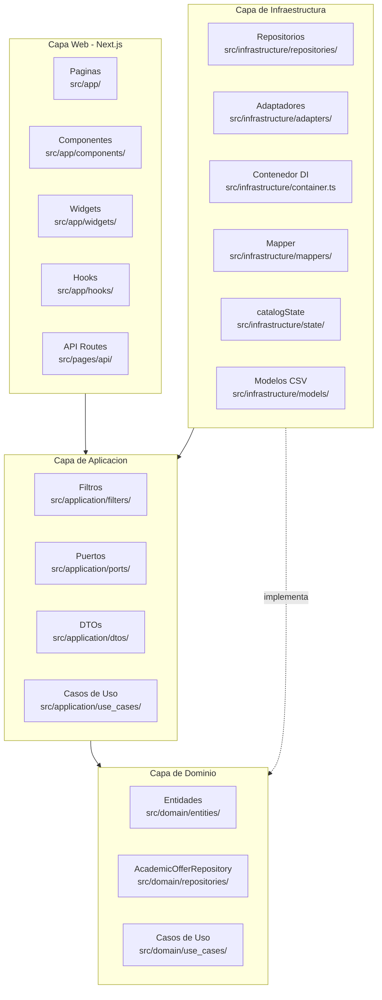

### Principio de Dependencia

Las capas externas dependen de las internas, nunca al reves.

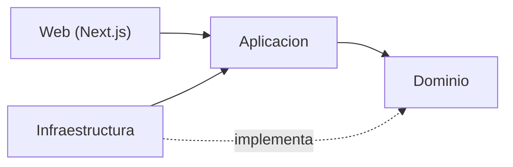

### Separacion Cliente / Servidor

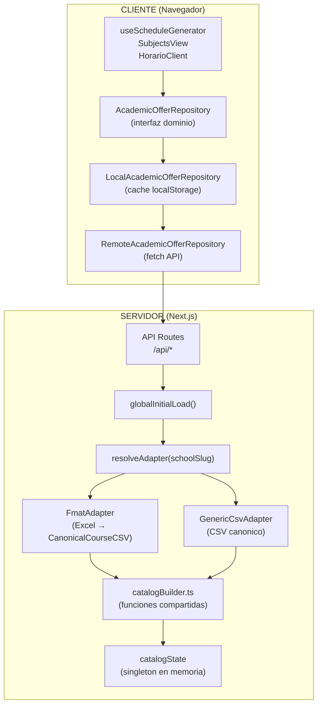

---

## 2. Capa de Dominio

### 2.1 Entidades

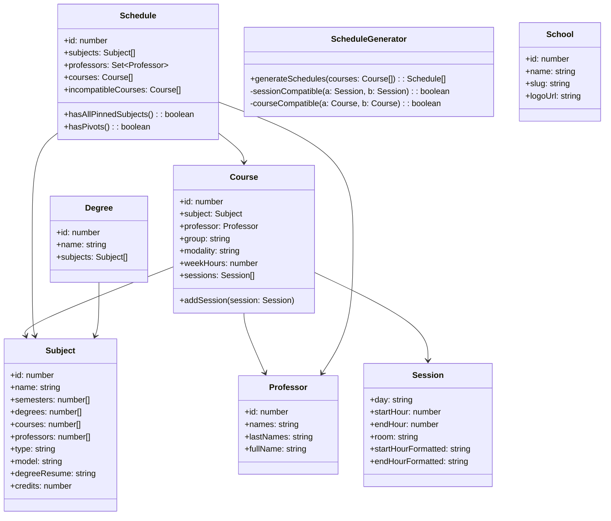

| Entidad | Archivo | Proposito |
|---------|---------|-----------|
| `Course` | `src/domain/entities/Course.ts` | Un curso/clase individual con su materia, profesor, grupo, modalidad y sesiones |
| `Subject` | `src/domain/entities/Subject.ts` | Una materia academica con creditos, semestres, tipo y modelo |
| `Professor` | `src/domain/entities/Professor.ts` | Un profesor con nombres y apellidos |
| `Session` | `src/domain/entities/Session.ts` | Una sesion de clase: dia, hora inicio/fin (en minutos), salon |
| `Degree` | `src/domain/entities/Degree.ts` | Una carrera con su lista de materias |
| `Schedule` | `src/domain/entities/Schedule.ts` | Un horario generado: combinacion de cursos compatibles |
| `ScheduleGenerator` | `src/domain/entities/ScheduleGenerator.ts` | **Algoritmo core** que genera todas las combinaciones posibles de horarios sin conflictos |
| `School` | `src/domain/entities/School.ts` | Escuela/facultad predefinida (FMAT, EDUCACION, ARQUITECTURA, PSICOLOGIA, CONTABILIDAD) |

### 2.2 Algoritmo de Generacion de Horarios

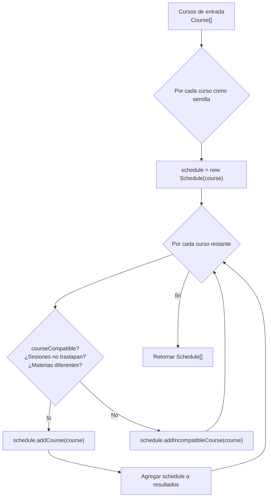

**Reglas de compatibilidad**:
- Dos sesiones son compatibles si no se traslapan en el mismo dia
- Dos cursos son compatibles si todas sus sesiones son compatibles Y son de materias diferentes
- Cada curso por si solo genera un horario valido

### 2.3 Interfaces de Dominio

#### AcademicOfferRepository (Cliente)

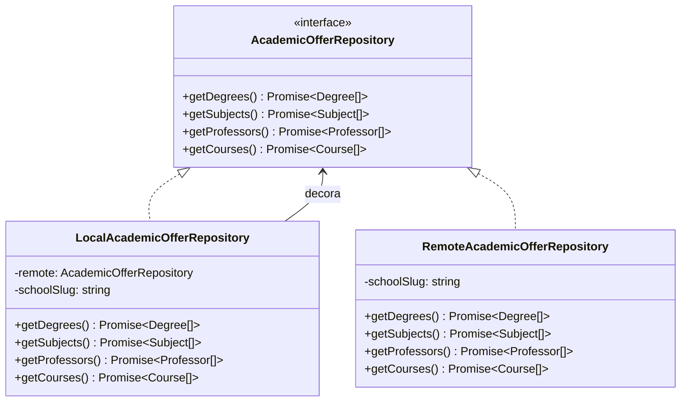

`LocalAcademicOfferRepository` es un **decorator**: envuelve otro `AcademicOfferRepository`, cachea en in-memory + localStorage (con version key), delega al remoto en cache miss.

#### SchoolDataAdapter (Servidor - Puerto)

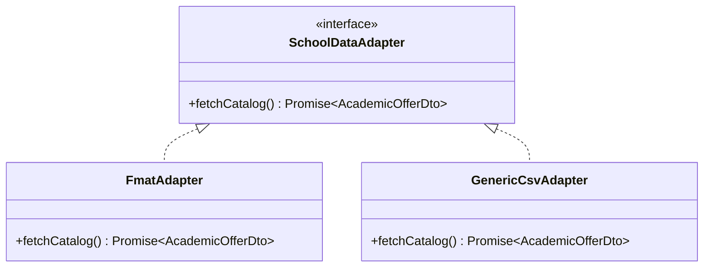

---

## 3. Capa de Aplicacion

### 3.1 Sistema de Filtros (Strategy + Composite)


### 3.2 Jerarquia de filtros

1. **Pre-generacion** (filtran cursos antes de combinarlos):
   - `DegreeFilter`: cursos que pertenecen a la(s) carrera(s) seleccionada(s)
   - `SubjectFilter`: cursos de materias seleccionadas
2. **Post-generacion** (filtran horarios ya generados):
   - `PinnedSubjectFilter`: solo horarios que contienen TODAS las materias pineadas
   - `PivotFilter`: solo horarios que respetan los pivotes (profesor-materia)

### 3.3 Puertos y DTOs

| Archivo | Tipo | Proposito |
|---------|------|-----------|
| `application/ports/SchoolDataAdapter.ts` | Puerto (interfaz) | Contrato para adaptadores que leen datos de una escuela |
| `application/dtos/AcademicOfferDto.ts` | DTO | `{ degrees, subjects, professors, courses }` — estructura de datos del catalogo |
| `application/use_cases/initialLoad.ts` | Caso de uso | Orquesta la carga inicial: `resolveAdapter(schoolSlug)` + `LoadCatalogUseCase` + `catalogState` |

---

## 4. Capa de Infraestructura

### 4.1 Componentes del Servidor

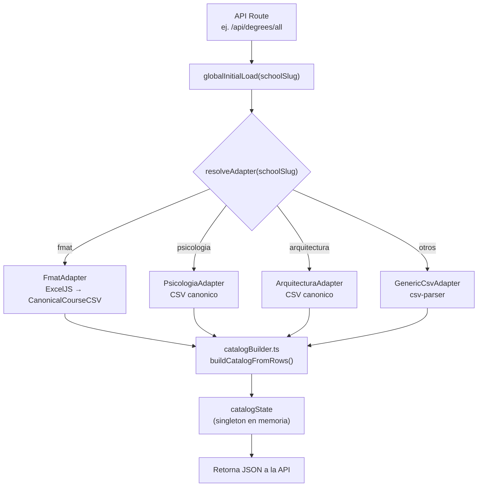

**`resolveAdapter(schoolSlug)` es la fabrica** que decide que adapter concreto usar segun la escuela. Esta en `initialLoad.ts`.

### 4.2 Componentes del Cliente

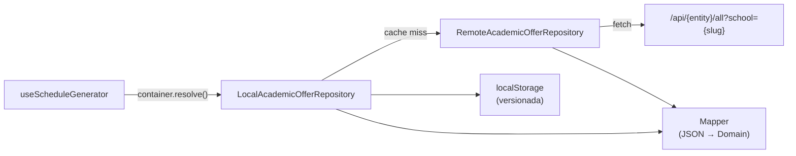

### 4.3 Adaptadores por Escuela

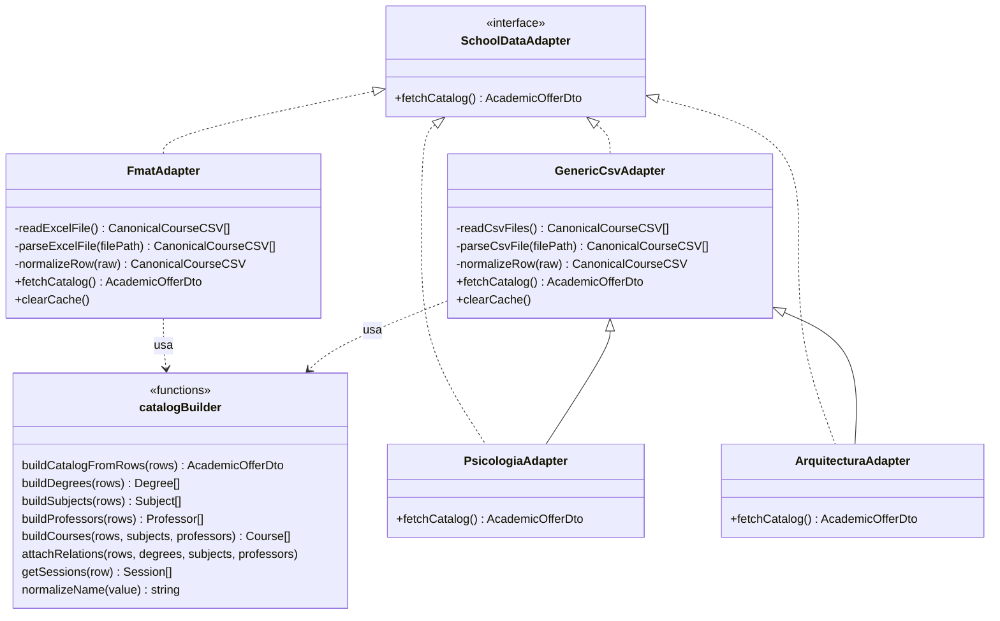

| Adapter | Fuente | Escuela(s) |
|---------|--------|-----------|
| `FmatAdapter` | Lee el Excel mas reciente de `public/data/fmat/`, parsea con ExcelJS, normaliza a `CanonicalCourseCSV[]` | `fmat` |
| `PsicologiaAdapter` | Extiende `GenericCsvAdapter`, lee CSV canonico de `public/data/psicologia/` | `psicologia` |
| `ArquitecturaAdapter` | Extiende `GenericCsvAdapter`, lee CSV canonico de `public/data/arquitectura/` | `arquitectura` |
| `GenericCsvAdapter` | Lee CSV canonico de `public/data/{schoolSlug}/`, parsea con `csv-parser` | Cualquier otra escuela |

### 4.4 cache: Local + localStorage

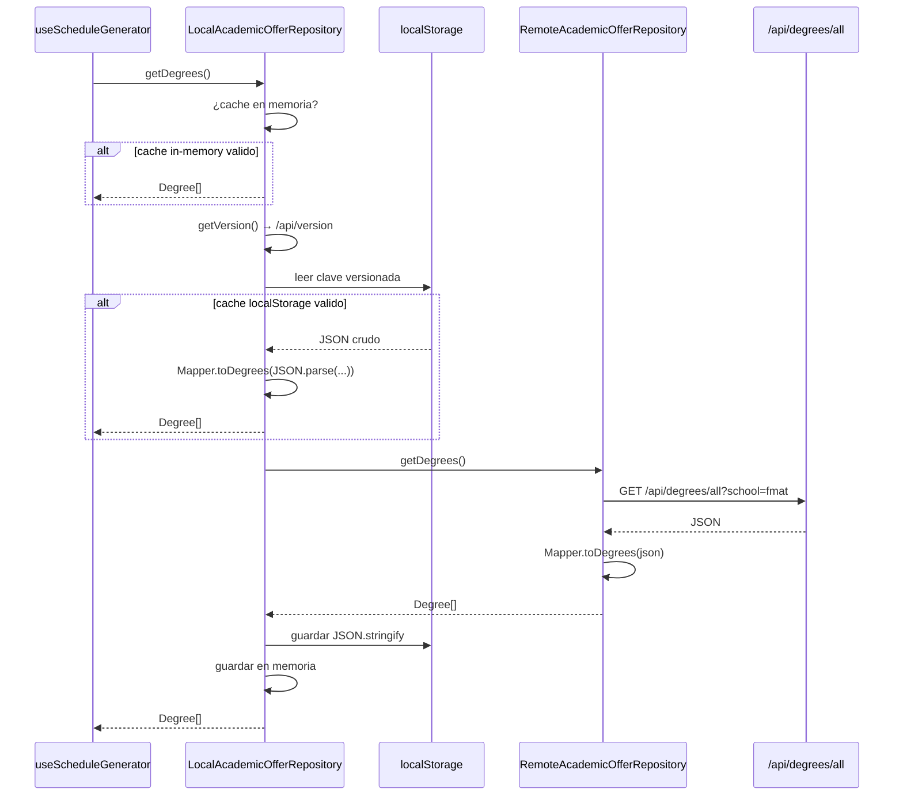

---

## 5. Capa Web (Next.js)

### 5.1 Arbol de Componentes - Pagina del Generador

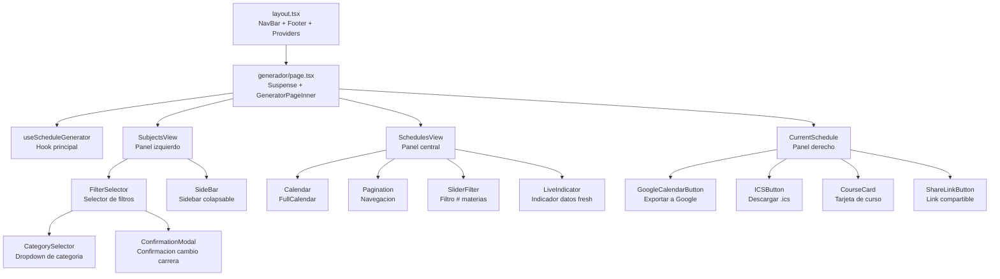

---

## 6. Flujo de Carga Inicial de Datos

### 6.1 Secuencia completa (servidor)

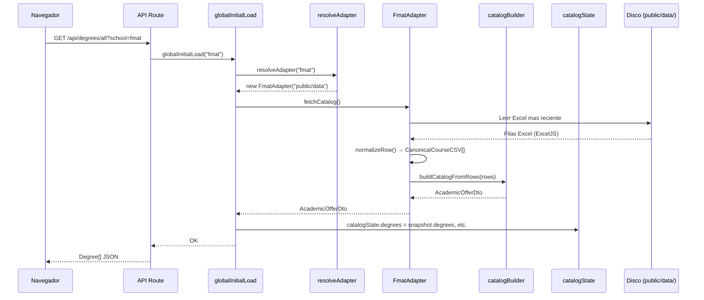

### 6.2 Pipeline de normalizacion

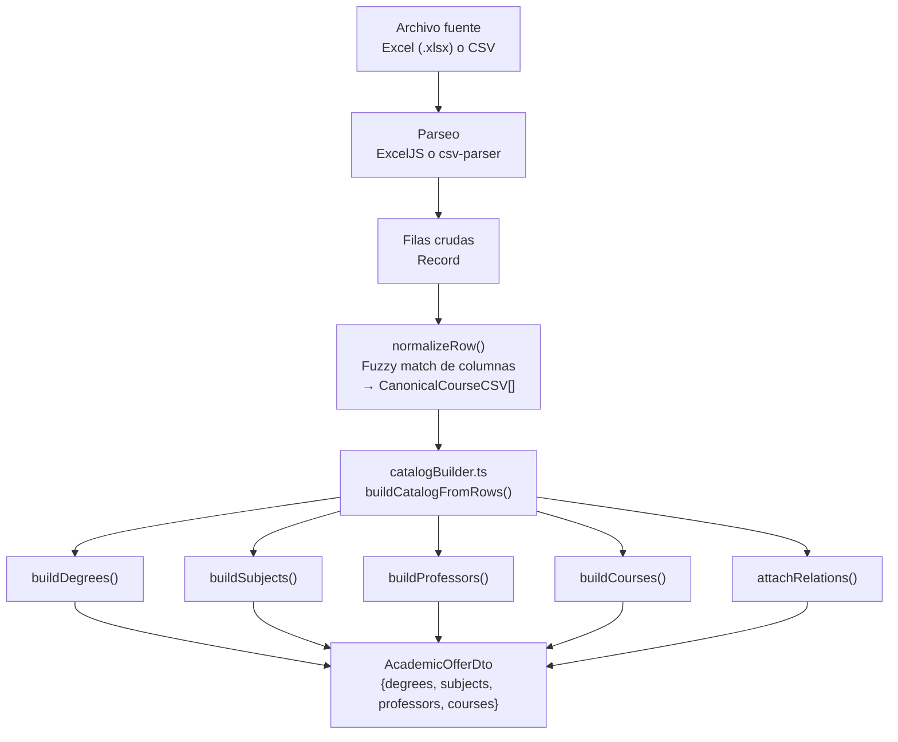

---

## 7. Flujo de Generacion de Horarios

### 7.1 Secuencia client-side

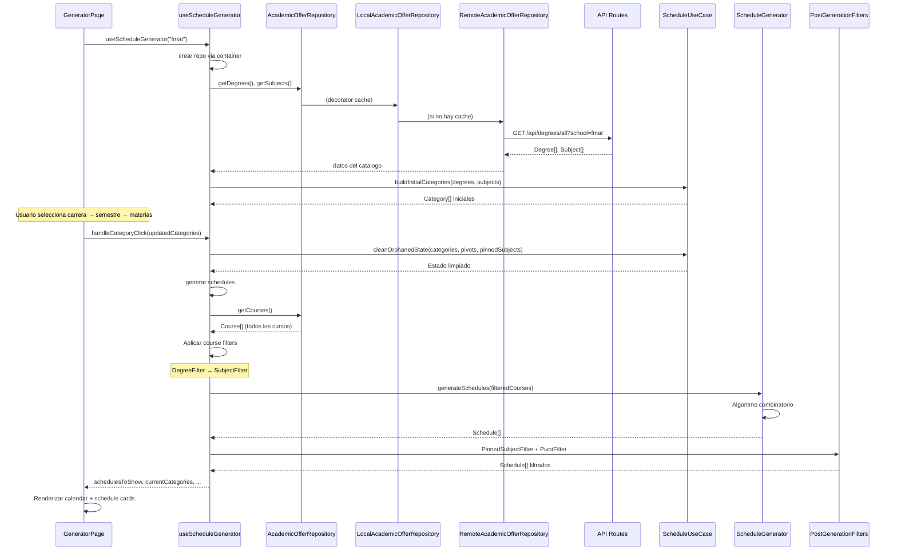

### 7.2 Pipeline de Filtros

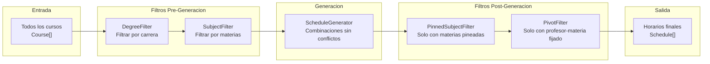

---

## 8. Sistema de Filtros

### 8.1 Jerarquia de Categorias en UI

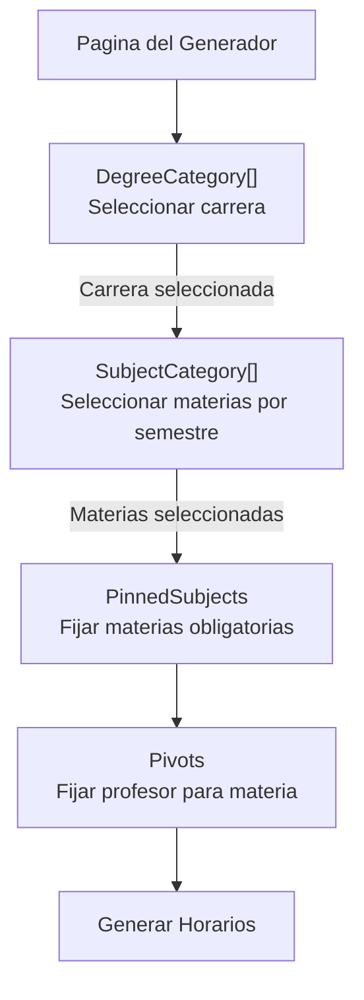

### 8.2 Interaccion entre Categorias

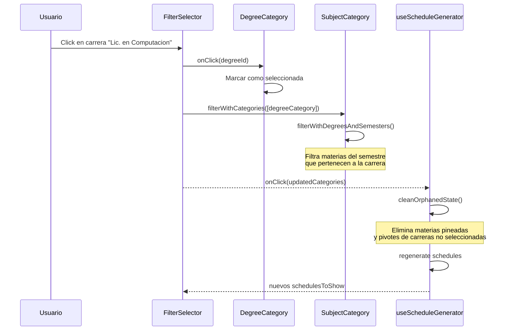

---

## 9. API Routes

### 9.1 Endpoints

| Ruta | Metodo | Parametro | Retorna |
|------|--------|-----------|---------|
| `/api/catalog` | GET | `?school={slug}` | `AcademicOfferDto` completo |
| `/api/courses/all` | GET | `?school={slug}` | `Course[]` |
| `/api/degrees/all` | GET | `?school={slug}` | `Degree[]` |
| `/api/professors/all` | GET | `?school={slug}` | `Professor[]` |
| `/api/subjects/all` | GET | `?school={slug}` | `Subject[]` |
| `/api/version` | GET | - | Version string (cache busting) |

### 9.2 Flujo de una API Route

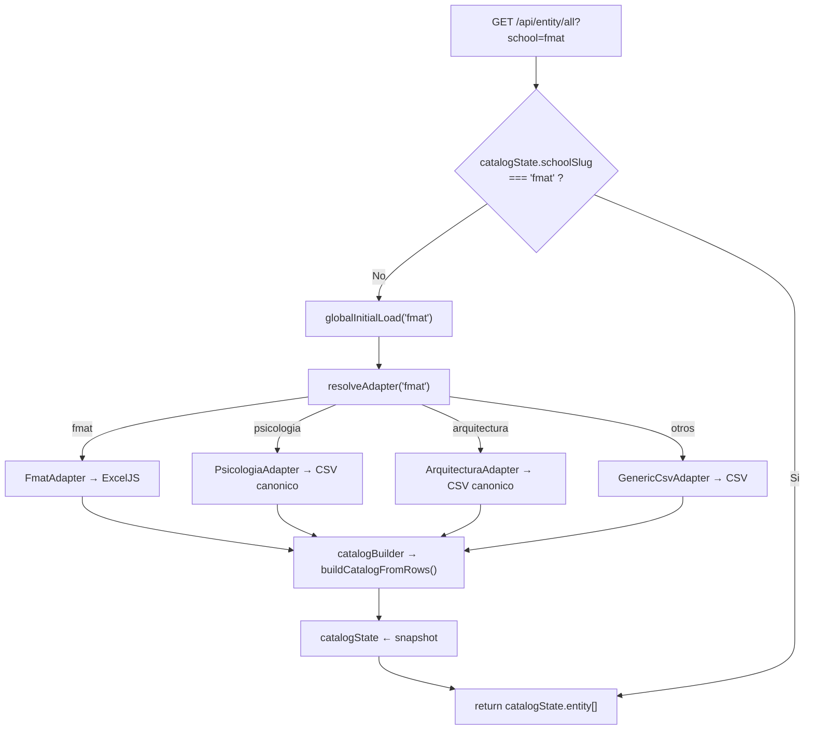

---

## 10. Exportacion a Google Calendar

```mermaid
sequenceDiagram
    participant User as Usuario
    participant UI as CurrentSchedule
    participant GCB as GoogleCalendarButton
    participant Hook as useGoogleAuth
    participant Supa as Supabase
    participant Google as Google OAuth
    participant GCal as Google Calendar API

    User->>UI: Click "Exportar a Google Calendar"
    UI->>GCB: Renderizar boton

    User->>GCB: Click en exportar

    alt No autenticado
        GCB->>GCB: Guardar estado en localStorage<br/>(schedule_state_before_oauth)
        GCB->>Hook: signInWithGoogle()
        Hook->>Supa: signInWithOAuth({provider:'google'})
        Supa->>Google: Redirigir a OAuth
        Google-->>User: Pantalla de login Google
        User->>Google: Autorizar permisos de Calendar
        Google-->>Supa: Callback con tokens
        Supa-->>App: Sesion iniciada
        Note over App: Recargar pagina, restaurar estado
    end

    GCB->>GCB: Crear eventos recurrentes
    loop Por cada Session del Schedule
        GCB->>GCal: insert(evento semanal recurrente)
        GCal-->>GCB: Evento creado
    end

    GCB-->>User: SweetAlert2: "Horario exportado exitosamente"
```

---

## 11. Estructura de Archivos

```
src/
├── app/                          # Next.js App Router
│   ├── components/               # Calendar, NavBar, FilterSelector, CategorySelector, SideBar,
│   │                             #   SliderFilter, Pagination, GoogleCalendarButton, ICSButton,
│   │                             #   ConfirmationModal, AdBanner, AdSense, Particles, etc.
│   ├── widgets/                  # CurrentSchedule, SchedulesView, SubjectsView
│   ├── hooks/                    # useScheduleGenerator, useGoogleAuth
│   ├── generador/                # Pagina principal del generador
│   │   └── horario/              # Vista de horario compartido (HorarioClient)
│   ├── contact/                  # Pagina del equipo
│   ├── faq/                      # FAQ
│   ├── motivation/               # Motivacion del proyecto
│   └── layout.tsx                # Layout raiz
│
├── application/
│   ├── filters/                  # Category, CourseFilter, DegreeCategory, SubjectCategory,
│   │                             #   DegreeFilter, SubjectFilter, DynamicCategory,
│   │                             #   Pivot, PivotFilter, PinnedSubjectFilter, PostGenerationFilter
│   ├── ports/                    # SchoolDataAdapter (puerto servidor)
│   ├── dtos/                     # AcademicOfferDto
│   └── use_cases/                # globalInitialLoad
│
├── domain/
│   ├── entities/                 # Course, Subject, Professor, Session, Degree,
│   │                             #   Schedule, ScheduleGenerator, School
│   ├── repositories/             # AcademicOfferRepository (interfaz unica)
│   └── use_cases/                # LoadCatalogUseCase, ScheduleUseCase
│
├── infrastructure/
│   ├── adapters/                 # FmatAdapter, PsicologiaAdapter, ArquitecturaAdapter, GenericCsvAdapter
│   │   └── helpers/              # catalogBuilder.ts (funciones compartidas de construccion de entidades)
│   ├── datasource/               # apiFetch.ts (fetch wrapper)
│   ├── repositories/             # RemoteAcademicOfferRepository, LocalAcademicOfferRepository
│   ├── mappers/                  # Mapper.ts (JSON ↔ Domain entities)
│   ├── models/                   # CanonicalCourseCSV.ts, FilterModel.ts
│   ├── state/                    # catalogState.ts (singleton en memoria)
│   └── container.ts              # Contenedor DI (register/resolve)
│
├── pages/api/                    # catalog/, courses/all, degrees/all, professors/all,
│                                 #   subjects/all, version (6 endpoints)
├── utils/                        # supabaseClient, EnumArray
└── Test/                         # Tests unitarios
```

---

## 12. Diagrama de Componentes (C4 - Nivel 2)

```mermaid
C4Context
    title Kiin - Diagrama de Contenedores

    Person(estudiante, "Estudiante UADY", "Busca armar su horario academico")

    System_Boundary(kiin, "Kiin Platform") {
        Container(webapp, "Web App", "Next.js 15, React, Tailwind", "Interfaz de usuario para generar horarios")
        Container(api, "API Routes", "Next.js Pages API", "Endpoints REST para datos del catalogo")
        ContainerDb(fs, "Archivos Excel/CSV", "public/data/", "Datos de cursos por escuela")
    }

    System_Ext(supabase, "Supabase", "Autenticacion Google OAuth")
    System_Ext(gcalendar, "Google Calendar API", "Exportacion de horarios")

    Rel(estudiante, "Genera horarios en", webapp, "HTTPS")
    Rel(webapp, "Consulta datos via", api, "HTTP REST")
    Rel(api, "Lee archivos con", fs, "Filesystem")
    Rel(webapp, "Autentica con", supabase, "OAuth 2.0")
    Rel(webapp, "Exporta eventos a", gcalendar, "Google API")
```

---

## 13. Patrones de Diseno y SOLID

### 13.1 Patrones de Diseno

| Patron | Donde se usa | Proposito |
|--------|-------------|-----------|
| **Repository** | `domain/repositories/AcademicOfferRepository.ts` → `infrastructure/repositories/Remote*`, `Local*` | Desacoplar logica de negocio del origen de datos (API vs localStorage) |
| **Port/Adapter (Hexagonal)** | `application/ports/SchoolDataAdapter.ts` → `infrastructure/adapters/FmatAdapter`, `PsicologiaAdapter`, `ArquitecturaAdapter`, `GenericCsvAdapter` | Cada escuela puede tener su propio formato (Excel, CSV). El puerto no cambia. |
| **Strategy** | `Filter`, `CourseFilter`, `PostGenerationFilter` | Diferentes estrategias de filtrado intercambiables |
| **Composite** | `Category`, `DegreeCategory`, `SubjectCategory` | Jerarquia de categorias de filtro en UI |
| **Decorator** | `LocalAcademicOfferRepository` envuelve `RemoteAcademicOfferRepository` | Agrega cache (in-memory + localStorage) sin modificar el remoto |
| **Chain of Responsibility** | Pipeline de filtros pre/post generacion | Aplicar filtros en secuencia |
| **Factory** | `resolveAdapter(schoolSlug)` en `initialLoad.ts` | Selecciona el adapter concreto segun la escuela |
| **Singleton** | `catalogState` | Cache en memoria del servidor |
| **DI Container** | `container.ts` | `register()`/`resolve()` para inyeccion de dependencias en cliente |
| **Template Method** | `GenericCsvAdapter` → `PsicologiaAdapter`, `ArquitecturaAdapter` extienden y heredan logica de lectura CSV | Reutilizacion sin duplicar codigo |
| **Facade** | `catalogBuilder.ts` expone `buildCatalogFromRows()` que orquesta `buildDegrees` + `buildSubjects` + `buildProfessors` + `buildCourses` + `attachRelations` | Una interfaz simple para un subsistema complejo |
| **Observer** | React state + hooks | Reactividad de la UI |

### 13.2 Principios SOLID

#### S — Single Responsibility (Responsabilidad Unica)

Cada clase tiene un solo motivo para cambiar:

| Clase | Responsabilidad |
|-------|----------------|
| `Course`, `Subject`, `Professor`, `Session`, `Degree`, `Schedule` | Representan un concepto del dominio. No saben de persistencia, UI, ni parsing |
| `ScheduleGenerator` | Solo genera combinaciones de horarios. No filtra, no cachea, no persiste |
| `FmatAdapter` | Solo lee Excel de FMAT y lo convierte a entidades. No sabe de otras escuelas |
| `PsicologiaAdapter` | Extiende `GenericCsvAdapter`, solo configura la escuela |
| `RemoteAcademicOfferRepository` | Solo hace fetch a la API. No cachea |
| `LocalAcademicOfferRepository` | Solo cachea. No hace fetch |
| `Mapper` | Solo convierte JSON ↔ entidades. No hace fetch ni parsea CSV |
| `catalogBuilder.ts` | Solo construye entidades desde `CanonicalCourseCSV[]`. No lee archivos |
| `FilterSelector` | Solo renderiza la UI de filtros. No contiene logica de filtrado |
| `globalInitialLoad` | Solo orquesta la carga inicial. No parsea archivos ni maneja HTTP |

#### O — Open/Closed (Abierto a extension, Cerrado a modificacion)

- **`SchoolDataAdapter`**: Agregar una nueva escuela (ej. `ContabilidadAdapter`) no requiere modificar el puerto ni los adapters existentes. Solo crear una clase nueva que implemente la interfaz y registrarla en `resolveAdapter()`.
- **`AcademicOfferRepository`**: Agregar un nuevo origen de datos (ej. `IndexedDbRepository`) no requiere modificar `Local` ni `Remote`. Solo crear una nueva implementacion.
- **`Category` / `CourseFilter` / `PostGenerationFilter`**: Agregar un nuevo tipo de filtro (ej. `ModalityFilter`) no modifica los existentes. Solo implementar la interfaz.
- **`SubjectCategory`** extiende `DynamicCategory` sin modificar su codigo base.

#### L — Liskov Substitution (Sustitucion de Liskov)

- **`PsicologiaAdapter` extends `GenericCsvAdapter`**: Cualquier codigo que espere un `GenericCsvAdapter` puede recibir un `PsicologiaAdapter` sin romperse. El comportamiento es identico (solo cambia el constructor).
- **`ArquitecturaAdapter` extends `GenericCsvAdapter`**: Mismo principio.
- **`LocalAcademicOfferRepository` implements `AcademicOfferRepository`**: El hook `useScheduleGenerator` funciona identico si se le inyecta `Local`, `Remote`, o cualquier otra implementacion.
- **`DegreeCategory` implements `Category`**: El `FilterSelector` no distingue entre categorias de carrera o semestre.

#### I — Interface Segregation (Segregacion de Interfaces)

- **`AcademicOfferRepository`** tiene 4 metodos especificos (`getDegrees`, `getSubjects`, `getProfessors`, `getCourses`). No obliga a implementar metodos innecesarios. Si una implementacion solo provee cursos, implementa solo `getCourses` (aunque actualmente todas implementan los 4, la interfaz no fuerza metodos que no se usan).
- **`Category` vs `CourseFilter` vs `PostGenerationFilter`**: Interfaces separadas y minimas. Una categoria no esta obligada a implementar filtros post-generacion.
- **`Filter`** solo expone `filter(courses)`. No acopla conceptos de UI ni de cache.

#### D — Dependency Inversion (Inversion de Dependencias)

Este es el principio mas presente en la arquitectura:

```
Capa Web → Application → Domain ← Infraestructura
                           ↑
                   (todas las flechas apuntan hacia aqui)
```

- **El dominio NO depende de infraestructura**: `Course`, `ScheduleGenerator`, `ScheduleUseCase` no importan nada de `infrastructure/`.
- **El dominio define contratos**: `AcademicOfferRepository` (interfaz en domain) es implementada por `Remote*` y `Local*` (en infraestructura).
- **Puertos en capa de aplicacion**: `SchoolDataAdapter` (interfaz en `application/ports/`) es implementada por `FmatAdapter`, `GenericCsvAdapter`, etc. (en `infrastructure/adapters/`).
- **Inyeccion por constructor**: `LoadCatalogUseCase` recibe `SchoolDataAdapter` por constructor, no instancia nada concreto.
- **Contenedor DI**: `container.ts` en infraestructura resuelve las dependencias concretas. Los consumidores (`useScheduleGenerator`) piden por interfaz, no por clase.
- **Factory `resolveAdapter()`**: El API no sabe que adapter se usa para cada escuela. La fabrica encapsula esa decision.

### 13.3 Mapa de dependencias (SOLID en la practica)

```
┌─────────────────────────────────────────────────────────────┐
│ DOMAIN (no depende de nadie)                                │
│  entities/   → Course, Subject, Professor, ...              │
│  repositories/ → AcademicOfferRepository (I)                │
│  use_cases/  → ScheduleUseCase, LoadCatalogUseCase          │
└────────────────────────┬────────────────────────────────────┘
                         │ implementa (DIP)
┌────────────────────────▼────────────────────────────────────┐
│ APPLICATION (depende de domain)                             │
│  filters/    → Category (I), CourseFilter (I), ...          │
│  ports/      → SchoolDataAdapter (I)                        │
│  dtos/       → AcademicOfferDto                             │
└────────────────────────┬────────────────────────────────────┘
                         │ implementa (DIP)
┌────────────────────────▼────────────────────────────────────┐
│ INFRASTRUCTURE (depende de domain + application)            │
│  adapters/   → FmatAdapter, PsicologiaAdapter, ...         │
│  repositories/ → Remote*, Local* (impl de repo)             │
│  container.ts → DI                                          │
│  mappers/    → Mapper                                       │
│  state/      → catalogState                                 │
└─────────────────────────────────────────────────────────────┘
```

