# Kiin - Arquitectura del Sistema

Kiin (del maya "tiempo") es una aplicacion web para generar horarios academicos. Lee datos de cursos desde archivos Excel/CSV, genera todas las combinaciones de horarios sin conflictos, y permite exportar a Google Calendar o `.ics`.

**Stack**: Next.js 15 (App Router + Pages API), TypeScript 5 strict, Tailwind CSS, HeroUI, FullCalendar, Supabase, ExcelJS.

---

## Indice

1. [Arquitectura General](#1-arquitectura-general)
2. [Capa de Dominio](#2-capa-de-dominio)
3. [Capa de Aplicacion](#3-capa-de-aplicacion)
4. [Capa de Infraestructura](#4-capa-de-infraestructura)
5. [Capa Web (Next.js)](#5-capa-web-nextjs)
6. [Flujo de Carga Inicial de Datos](#6-flujo-de-carga-inicial-de-datos)
7. [Flujo de Generacion de Horarios](#7-flujo-de-generacion-de-horarios)
8. [Sistema de Filtros](#8-sistema-de-filtros)
9. [API Routes](#9-api-routes)
10. [Exportacion a Google Calendar](#10-exportacion-a-google-calendar)

---

## 1. Arquitectura General

El proyecto sigue **Clean Architecture** con 4 capas, mas la capa Web de Next.js como interfaz.

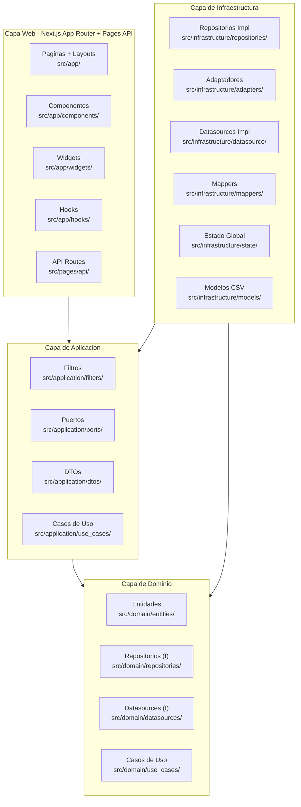

### Principio de Dependencia

Las flechas van hacia el dominio. Las capas externas dependen de las internas, nunca al reves.

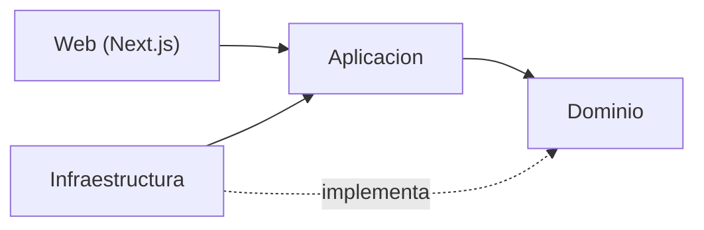

---

## 2. Capa de Dominio

### 2.1 Entidades


| Entidad | Archivo | Proposito |
|---------|---------|-----------|
| `Course` | `src/domain/entities/Course.ts` | Un curso/clase individual con su materia, profesor, grupo, modalidad y sesiones |
| `Subject` | `src/domain/entities/Subject.ts` | Una materia academica con creditos, semestres, tipo y modelo |
| `Professor` | `src/domain/entities/Professor.ts` | Un profesor con nombres y apellidos |
| `Session` | `src/domain/entities/Session.ts` | Una sesion de clase: dia, hora inicio/fin (en minutos), salon |
| `Degree` | `src/domain/entities/Degree.ts` | Una carrera con su lista de materias |
| `Schedule` | `src/domain/entities/Schedule.ts` | Un horario generado: combinacion de cursos compatibles |
| `ScheduleGenerator` | `src/domain/entities/ScheduleGenerator.ts` | **Algoritmo core** que genera todas las combinaciones posibles de horarios sin conflictos |
| `School` | `src/domain/entities/School.ts` | Escuela/facultad predefinida (FMAT, EDUCACION, etc.) |

### 2.2 Algoritmo de Generacion de Horarios

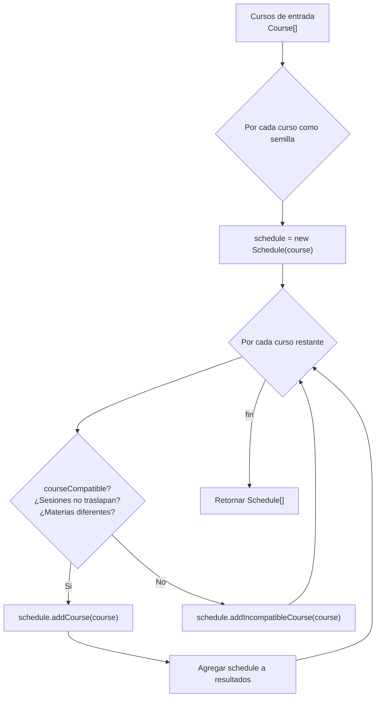

**Reglas de compatibilidad**:
- Dos sesiones son compatibles si no se traslapan en el mismo dia
- Dos cursos son compatibles si todas sus sesiones son compatibles Y son de materias diferentes
- Cada curso por si solo genera un horario valido

### 2.3 Interfaces de Repositorio y Datasource

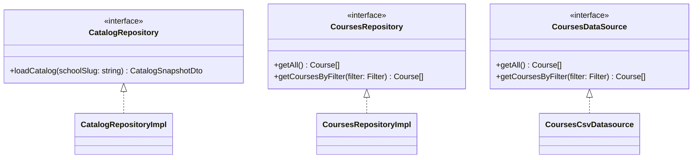

---

## 3. Capa de Aplicacion

### 3.1 Sistema de Filtros (Strategy + Composite)

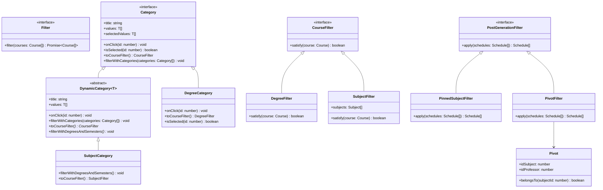

### Jerarquia de filtros

1. **Pre-generacion** (filtran cursos antes de combinarlos):
   - `DegreeFilter`: cursos que pertenecen a la(s) carrera(s) seleccionada(s)
   - `SubjectFilter`: cursos de materias seleccionadas
2. **Post-generacion** (filtran horarios ya generados):
   - `PinnedSubjectFilter`: solo horarios que contienen TODAS las materias pineadas
   - `PivotFilter`: solo horarios que respetan los pivotes (profesor-materia)

---

## 4. Capa de Infraestructura

### 4.1 Componentes

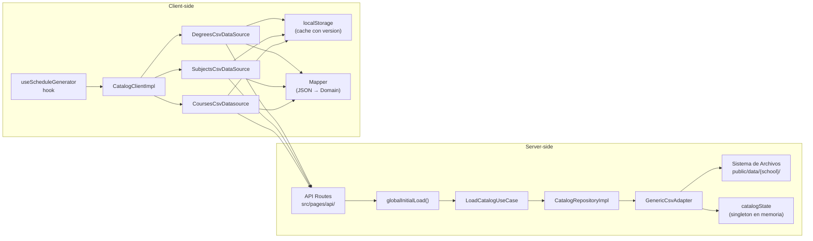

### 4.2 Estrategia de Caching

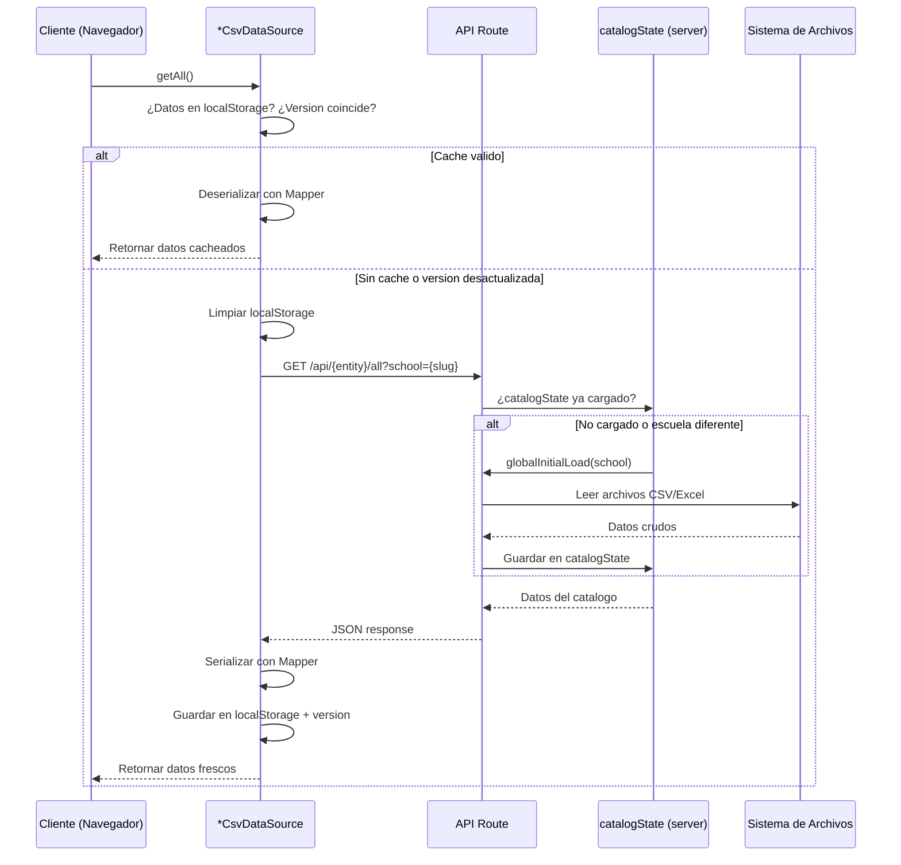

---

## 5. Capa Web (Next.js)

### 5.1 Arbol de Componentes - Pagina del Generador

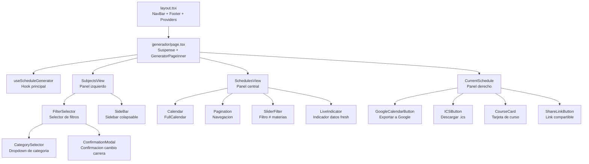

---

## 6. Flujo de Carga Inicial de Datos

### 6.1 Secuencia completa (server-side)

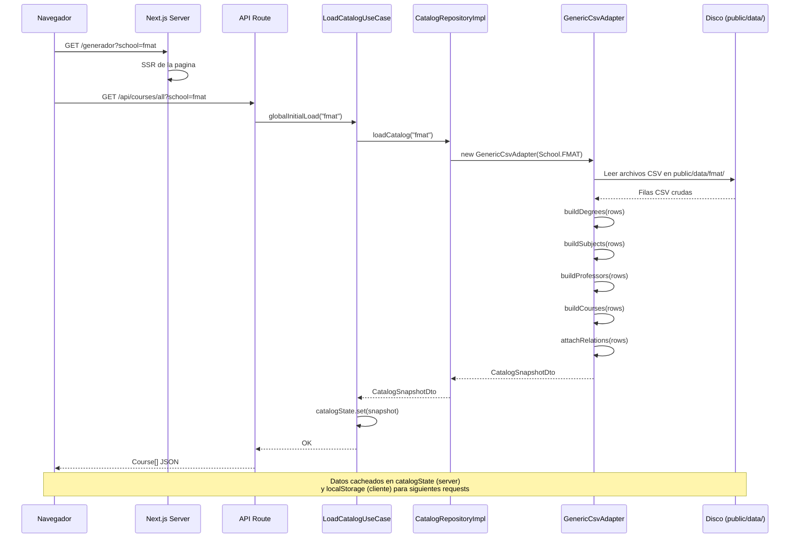

### 6.2 Adaptador CSV a Entidades de Dominio

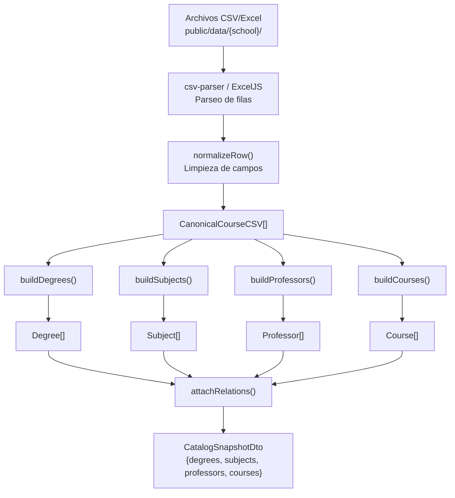

---

## 7. Flujo de Generacion de Horarios

### 7.1 Secuencia client-side

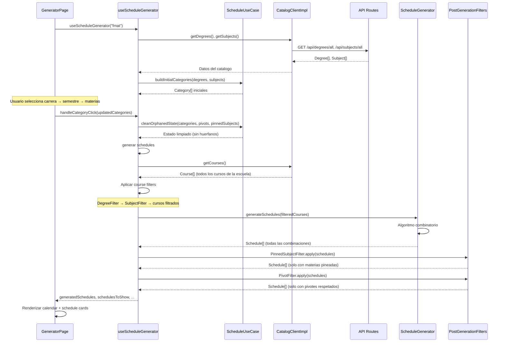

### 7.2 Pipeline de Filtros

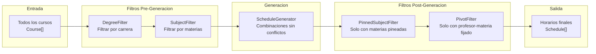

---

## 8. Sistema de Filtros

### 8.1 Jerarquia de Categorias en UI

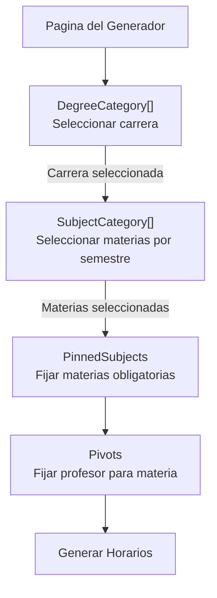

### 8.2 Interaccion entre Categorias

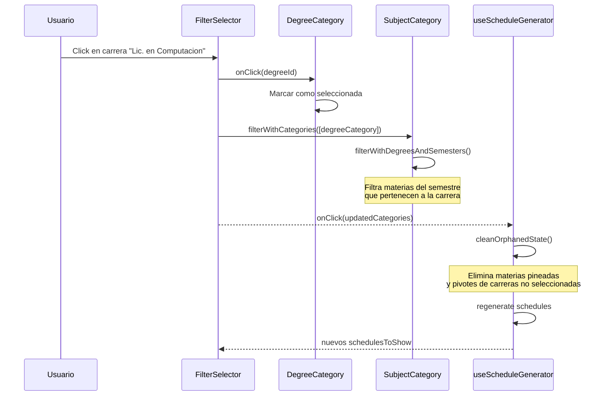

---

## 9. API Routes

### 9.1 Endpoints

| Ruta | Metodo | Parametro | Retorna |
|------|--------|-----------|---------|
| `/api/catalog` | GET | `?school={slug}` | `CatalogSnapshotDto` completo |
| `/api/courses/all` | GET | `?school={slug}` | `Course[]` |
| `/api/degrees/all` | GET | `?school={slug}` | `Degree[]` |
| `/api/professors/all` | GET | `?school={slug}` | `Professor[]` |
| `/api/subjects/all` | GET | `?school={slug}` | `Subject[]` |
| `/api/version` | GET | - | Version string (cache busting) |

### 9.2 Patron comun de API Route

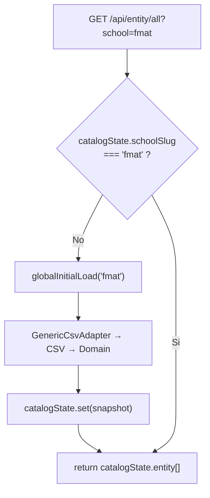

---

## 10. Exportacion a Google Calendar

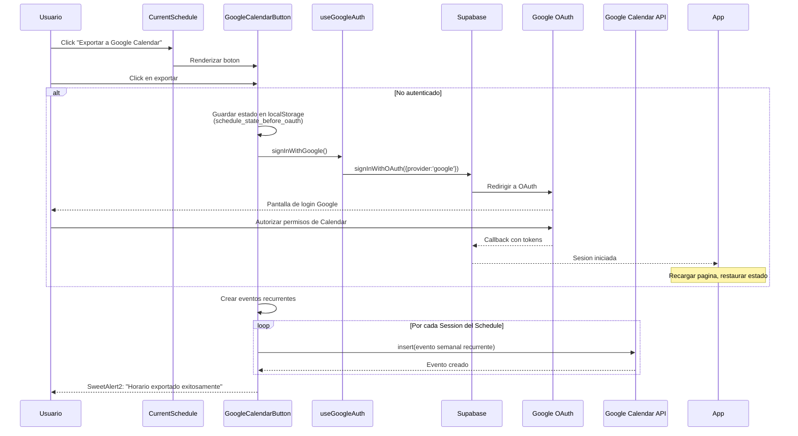

---

## 11. Estructura de Archivos

```
src/
├── app/                          # Next.js App Router
│   ├── components/               # 15+ componentes reutilizables
│   ├── widgets/                  # 3 widgets principales (Subjects, Schedules, Current)
│   ├── hooks/                    # useScheduleGenerator, useGoogleAuth
│   ├── generador/                # Pagina principal del generador
│   │   └── horario/              # Vista de horario compartido
│   ├── contact/                  # Pagina del equipo
│   ├── faq/                      # FAQ
│   ├── motivation/               # Motivacion del proyecto
│   └── layout.tsx                # Layout raiz
│
├── application/
│   ├── filters/                  # Sistema de filtros (Category, Filter, Pivot)
│   ├── ports/                    # Puertos (CatalogClientPort, SchoolDataAdapter)
│   ├── dtos/                     # CatalogSnapshotDto
│   └── use_cases/                # globalInitialLoad
│
├── domain/
│   ├── entities/                 # 12 entidades de dominio
│   ├── repositories/             # 5 interfaces de repositorio
│   ├── datasources/              # 4 interfaces de datasource
│   └── use_cases/                # LoadCatalogUseCase, ScheduleUseCase
│
├── infrastructure/
│   ├── adapters/                 # GenericCsvAdapter
│   ├── datasource/               # Impls cliente (fetch+localStorage) y servidor (Excel)
│   ├── repositories/             # 5 implementaciones de repositorio
│   ├── mappers/                  # Mapper (JSON↔Domain), FmatCourseMapper, FmatSubjectMapper
│   ├── helpers/                  # normalizeName
│   ├── models/                   # CanonicalCourseCSV, CourseCSV, FilterModel
│   └── state/                    # catalogState (singleton)
│
├── pages/api/                    # 6 API routes (Pages Router)
├── utils/                        # supabaseClient, EnumArray
└── Test/                         # Tests unitarios
```

---

## 12. Diagrama de Componentes (C4 - Nivel 2)

```mermaid
C4Context
    title Kiin - Diagrama de Contenedores

    Person(estudiante, "Estudiante UADY", "Busca armar su horario academico")

    System_Boundary(kiin, "Kiin Platform") {
        Container(webapp, "Web App", "Next.js 15, React, Tailwind", "Interfaz de usuario para generar horarios")
        Container(api, "API Routes", "Next.js Pages API", "Endpoints REST para datos del catalogo")
        ContainerDb(fs, "Archivos CSV/Excel", "public/data/", "Datos de cursos por escuela")
    }

    System_Ext(supabase, "Supabase", "Autenticacion Google OAuth")
    System_Ext(gcalendar, "Google Calendar API", "Exportacion de horarios")

    Rel(estudiante, "Genera horarios en", webapp, "HTTPS")
    Rel(webapp, "Consulta datos via", api, "HTTP REST")
    Rel(api, "Lee archivos de", fs, "Filesystem")
    Rel(webapp, "Autentica con", supabase, "OAuth 2.0")
    Rel(webapp, "Exporta eventos a", gcalendar, "Google API")
```

---

## 13. Patrones de Diseno Utilizados

| Patron | Donde se usa | Proposito |
|--------|-------------|-----------|
| **Repository** | `domain/repositories/` → `infrastructure/repositories/` | Desacoplar dominio de la persistencia |
| **Adapter** | `GenericCsvAdapter` | Adaptar datos CSV a entidades de dominio |
| **Strategy** | `Filter`, `CourseFilter`, `PostGenerationFilter` | Diferentes estrategias de filtrado intercambiables |
| **Composite** | `Category`, `DegreeCategory`, `SubjectCategory` | Jerarquia de categorias de filtro en UI |
| **Chain of Responsibility** | Pipeline de filtros pre/post generacion | Aplicar filtros en secuencia |
| **Singleton** | `catalogState` | Cache en memoria del servidor |
| **Dependency Injection** | Constructores de repositorios/datasources | Inversion de control |
| **Observer** | React state + hooks | Reactividad de la UI |
| **Port/Adapter (Hexagonal)** | `application/ports/` | Puertos entre capas de aplicacion e infraestructura |
