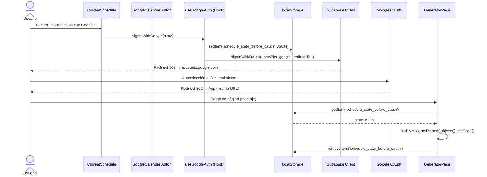
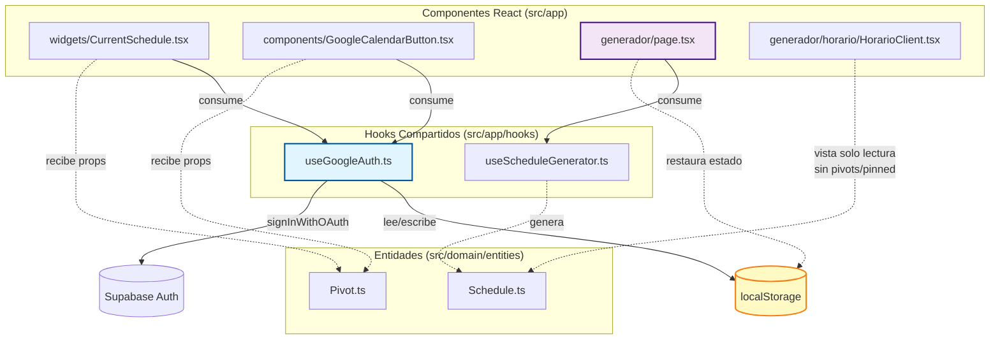

# Plantilla de Diseño de Solución Arquitectónica (DOS)

**Código:** DOC-DOS-02  
**Versión:** 2.0  
**Relacionado con:** MR-7  
**Equipo Asignado:** Alfa  
**Analista Principal:** Rodrigo Pacab  
**Analista Revisor (Par):** [Pendiente de asignar]

---

## **1. Ideación y Fundamentación Teórica**

* **Patrón de Diseño GoF Aplicado:**  
  * *Facade* (vía el hook `useGoogleAuth`) y *Memento* (vía la serialización del estado del horario en `localStorage`).
  * *Justificación:* El patrón *Facade* simplifica la interfaz de autenticación OAuth al unificar la llamada a `signInWithOAuth` en un único punto de acceso, eliminando la lógica duplicada en `CurrentSchedule.tsx` y `GoogleCalendarButton.tsx`. El patrón *Memento* permite capturar y externalizar el estado interno del horario (`ids`, `pivots`, `pinnedSubjects`) sin violar el encapsulamiento, posibilitando su restauración tras el redirect del navegador.

* **Principio de Diseño (SOLID) Priorizado:**  
  * *Single Responsibility Principle (SRP)* y *Don't Repeat Yourself (DRY)*.
  * *Justificación:* Actualmente ambos componentes (`CurrentSchedule.tsx` y `GoogleCalendarButton.tsx`) contienen funciones duplicadas (`GoogleSignIn`, `popupRef`, `useEffect` de cierre). La extracción de un hook compartido `useGoogleAuth` asigna la responsabilidad única de orquestar la autenticación a un módulo dedicado, reduciendo la carga cognitiva y el WMC de los componentes (ambos con WMC estimado >15, lo que prohibe añadir más lógica directa).

* **Técnica Algorítmica / Complejidad Esperada (Big-O):**  
  * Serialización/deserialización del estado: **O(n)** donde *n* es la cantidad de cursos/pivots. Búsqueda en `localStorage`: **O(1)**.
  * *Justificación:* La persistencia opera sobre estructuras planas (arreglos de IDs y objetos simples). No hay recursión ni recorridos anidados, por lo que la complejidad es lineal respecto al tamaño del horario y constante para las operaciones de almacenamiento local.

---

## **2. Diseño Técnico y Métricas**

* **Diagrama de Flujo / UML (Enlace o Imagen):**

### Diagrama de Secuencia — Flujo OAuth Redirect + Persistencia de Estado



### Diagrama de Componentes — Nueva Arquitectura Post-Refactor



* **Métricas Estructurales de la Propuesta:**  
  * *Complejidad Ciclomática (CC) y WMC esperada:*
    * `useGoogleAuth.ts`: CC = 2 (path principal + manejo de error), WMC estimado = 3 (signIn, persist, cleanup).
    * `CurrentSchedule.tsx`: WMC se reduce al eliminar `GoogleSignIn`, `popupRef` y `useEffect` de popup (estimado -3 a -4 puntos de WMC). Conserva `exportMenuRef` y su lógica.
    * `GoogleCalendarButton.tsx`: WMC se reduce similarmente al eliminar la misma lógica duplicada. Se eliminan completamente `useRef` e `useEffect` de sus imports.
    * `GeneratorPage.tsx`: WMC incremento mínimo de +1 por el `useEffect` de restauración (controlado y justificado).

* **Propuesta de Código (Snippets en TypeScript):**

**Nota de double-check:** El proyecto utiliza la convención `src/app/hooks/` (existente, contiene `useScheduleGenerator.ts`). El hook compartido debe ubicarse en `src/app/hooks/useGoogleAuth.ts` para mantener consistencia estructural. La clase `Pivot` (`src/domain/entities/Pivot.ts`) consta únicamente de dos primitivas (`idSubject`, `idProfessor`), por lo que es directamente serializable mediante `JSON.stringify` sin riesgo de referencias circulares.

**`src/app/hooks/useGoogleAuth.ts`**
```typescript
import { useSupabaseClient } from '@supabase/auth-helpers-react';
import { Pivot } from '@/domain/entities/Pivot';

export interface ScheduleState {
  ids: number[];
  pivots: Pivot[];
  pinnedSubjects: number[];
  page?: number;
}

export function useGoogleAuth() {
  const supabase = useSupabaseClient();

  const signInWithGoogle = async (scheduleState?: ScheduleState) => {
    if (scheduleState) {
      localStorage.setItem(
        'schedule_state_before_oauth',
        JSON.stringify(scheduleState)
      );
    }

    const { error } = await supabase.auth.signInWithOAuth({
      provider: 'google',
      options: {
        scopes: 'https://www.googleapis.com/auth/calendar',
        redirectTo: window.location.href,
      },
    });

    if (error) {
      console.error('OAuth redirect error:', error);
      throw error;
    }
  };

  return { signInWithGoogle };
}
```

**`src/app/widgets/CurrentSchedule.tsx` — Ajustes requeridos**
```typescript
// Importar el hook compartido
import { useGoogleAuth } from '@/app/hooks/useGoogleAuth';

// En el cuerpo del componente, reemplazar:
// const popupRef = useRef<Window | null>(null);   <-- ELIMINAR
// function GoogleSignIn() { ... }                  <-- ELIMINAR
// useEffect(() => { if (session && popupRef.current) ... }, [session]);  <-- ELIMINAR

const { signInWithGoogle } = useGoogleAuth();

// Reemplazar las dos llamadas a GoogleSignIn() por:
await signInWithGoogle({
  ids: schedule.courses.map(c => c.id),
  pivots: pivots ?? [],
  pinnedSubjects: pinnedSubjects ?? []
});

// NOTA: exportMenuRef y su useEffect de cierre fuera de clic SE CONSERVAN.
// El import de useRef SE CONSERVA porque exportMenuRef lo requiere.
```

**`src/app/components/GoogleCalendarButton.tsx` — Ajustes requeridos**
```typescript
// Nuevas props necesarias para persistir estado
interface GoogleCalendarButtonProps {
  schedule: Schedule;
  recurrenceStart: Date;
  recurrenceEnd: Date;
  pivots?: Pivot[];
  pinnedSubjects?: number[];
}

// Importar el hook compartido
import { useGoogleAuth } from '@/app/hooks/useGoogleAuth';

// En el cuerpo del componente:
// const popupRef = useRef<Window | null>(null);   <-- ELIMINAR
// function GoogleSignIn() { ... }                  <-- ELIMINAR
// useEffect(() => { if (session && popupRef.current) ... }, [session]);  <-- ELIMINAR

const { signInWithGoogle } = useGoogleAuth();

// Reemplazar el bloque de línea ~119 (signInWithOAuth directo) y la llamada
// de línea ~147 (GoogleSignIn()) por una sola llamada unificada:
if (!session || !accessToken) {
  await signInWithGoogle({
    ids: schedule.courses.map(c => c.id),
    pivots: pivots ?? [],
    pinnedSubjects: pinnedSubjects ?? []
  });
  return;
}

// NOTA: Tras la limpieza, los imports de useRef y useEffect se eliminan
// (useState es el único hook restante de React en este componente).
```

**Restauración de estado — `src/app/generador/page.tsx`**

*Nota de double-check:* El DER original propone `HorarioClient.tsx` como punto de restauración. Sin embargo, tras revisar el código fuente, `HorarioClient.tsx` (`src/app/generador/horario/HorarioClient.tsx`) es una vista de solo lectura para horarios compartidos por URL; no posee estado de `pivots` ni `pinnedSubjects`. El componente que posee dicho estado es `GeneratorPage` (`src/app/generador/page.tsx`), que utiliza el hook `useScheduleGenerator`. Por tanto, el `useEffect` de restauración debe ubicarse en `GeneratorPage`.

```typescript
import { useGoogleAuth, ScheduleState } from '@/app/hooks/useGoogleAuth';

// Dentro de GeneratorPage, agregar:
useEffect(() => {
  const raw = localStorage.getItem('schedule_state_before_oauth');
  if (!raw) return;

  try {
    const state: ScheduleState = JSON.parse(raw);
    if (state.pivots) setPivots(state.pivots);
    if (state.pinnedSubjects) setPinnedSubjects(state.pinnedSubjects);
    if (typeof state.page === 'number') setPage(state.page);
    localStorage.removeItem('schedule_state_before_oauth');
  } catch (e) {
    console.error('Failed to restore schedule state', e);
    // Mantener en localStorage para posible reintento o diagnóstico
  }
}, []); // Se ejecuta una sola vez al montar tras el redirect
```

---

## **3. Historial de Pivotes (Sad Path / Alternativas Descartadas)**

* **Enfoque Inicial Intentado:**
  Mantener el flujo popup (`skipBrowserRedirect: true` + `window.open`) e intentar restaurar la "trusted user gesture" moviendo el `window.open` inmediatamente después del clic del usuario, sin `await` previo.

* **Motivo Técnico del Rechazo:**
  Aunque ciertas reorganizaciones de código pueden preservar el gesture en algunos navegadores, el comportamiento es inconsistente entre Chrome, Firefox y Safari, y las políticas de bloqueo de popups evolucionan continuamente. No garantiza compatibilidad estable (RNF-015 requiere compatibilidad confiable). El redirect de página completa es el mecanismo estándar y soportado universalmente por Supabase Auth.

---

## **4. Estimación de Esfuerzo y Riesgos Internos**

* **Esfuerzo Estimado (Puntos Fibonacci):** 5 Puntos.
  * *Justificación del esfuerzo:* La tarea implica refactorización controlada (extracción de hook, eliminación de código duplicado, dos puntos de integración y un useEffect de restauración). No hay lógica de negocio nueva ni cambios en el modelo de datos. El alcance está acotado a 4 archivos con cambios mecánicos y bien definidos.

* **Cálculo de Riesgo Técnico (NVR):**
  * Probabilidad [2] x Impacto [2] = **4**
  * *Riesgo principal:* La URL de `redirectTo` no coincide exactamente con las URLs permitidas en el dashboard de Supabase, causando un error de redirect en producción.
  * *Riesgo secundario:* `GeneratorPage` regenera horarios de forma asíncrona al montar (vía `useScheduleGenerator`). Si el `useEffect` de restauración setea `page` antes de que los horarios se generen, el índice podría ser inválido momentáneamente.

* **Estrategia de Mitigación:**
  1. Verificar explícitamente en el dashboard de Supabase (`Authentication > URL Configuration > Redirect URLs`) que el dominio de producción y `localhost:3000` estén registrados.
  2. La restauración de `page` en `GeneratorPage` debe ser defensiva: si `state.page >= schedulesToShow.length`, setear `page = 0` como fallback.
  3. Implementar la restauración de forma atómica: si la deserialización falla, no eliminar la clave de `localStorage` para permitir diagnóstico.
  4. Realizar pruebas de regresión (`npm run build`, `npm test`) inmediatamente después de la eliminación del código popup.

---

## **5. Resolución Formal**

**[ ] Aprobado.**

**[ ] Aprobado con condiciones.**

* **Especificar restricciones, acciones obligatorias o cambios requeridos**

**[ ] Rechazado**

* **Motivo(s) de rechazo**

**Comentarios del Líder Técnico / Motivo de decisión:** [Pendiente de revisión técnica]

---

## **6. Notas de Double-Check contra Código Fuente (Post-Diseño)**

Durante la elaboración de este DOS se realizó una verificación directa sobre los archivos de código fuente del repositorio. Los hallazgos relevantes que ajustan o refuerzan este diseño son:

1. **Estructura de hooks:** El proyecto posee la carpeta `src/app/hooks/` (contiene `useScheduleGenerator.ts`), no `src/hooks/`. Se ajustó la ruta propuesta a `src/app/hooks/useGoogleAuth.ts` para respetar la convención existente.

2. **Serialización de estado:** La entidad `Pivot` (`src/domain/entities/Pivot.ts`) es una clase con solo dos campos primitivos (`idSubject: number`, `idProfessor: number`), confirmando que su serialización con `JSON.stringify` es segura y libre de referencias circulares.

3. **Persistencia en `GoogleCalendarButton`:** El componente `GoogleCalendarButton.tsx` no recibe actualmente `pivots` ni `pinnedSubjects`. El diseño incorpora la adición de dichas props al interfaz del componente para que pueda inyectar el estado completo al hook `useGoogleAuth`.

4. **Conservación de `useRef` en `CurrentSchedule.tsx`:** El `useRef` de `exportMenuRef` (línea 31) se utiliza para el manejo del menú de exportación (cierre al hacer clic fuera). Por tanto, aunque se elimina `popupRef`, el import de `useRef` y la referencia `exportMenuRef` deben conservarse.

5. **Eliminación completa de `useRef`/`useEffect` en `GoogleCalendarButton.tsx`:** Tras eliminar `popupRef` y su `useEffect`, este componente ya no requiere `useRef` ni `useEffect` para el flujo de auth. Solo conserva `useState` para `isExporting`.

6. **Punto de restauración:** `HorarioClient.tsx` (`src/app/generador/horario/HorarioClient.tsx`) es una vista de horarios compartidos por query string (`?ids=...`); no gestiona `pivots` ni `pinnedSubjects`. El punto correcto para restaurar el estado completo es `GeneratorPage` (`src/app/generador/page.tsx`), que sí posee y controla dichos estados vía `useScheduleGenerator`. El diseño refleja esta corrección.

7. **Redirección implícita en `GoogleCalendarButton.tsx`:** En la línea ~119 existía una llamada a `signInWithOAuth` sin `redirectTo` explícito. El hook unificado `useGoogleAuth` garantiza que siempre se envíe `redirectTo: window.location.href`.

---

*Notas de trazabilidad derivadas del DER-7:*
- Este diseño satisface los requisitos funcionales RF-MR7-1 al RF-MR7-5 y el no funcional RFN-MR7-1.
- Impacta el requisito existente RNF-015 (modificación del método de autenticación de popup a redirect).
- No modifica la lógica de exportación a Google Calendar (RF-054 a RF-057), únicamente el mecanismo de autenticación previo.
