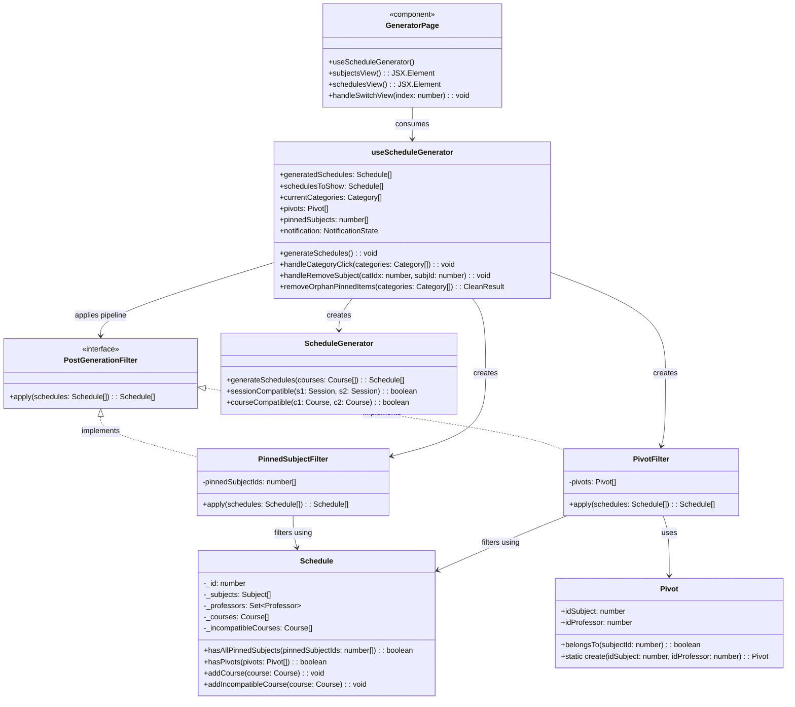
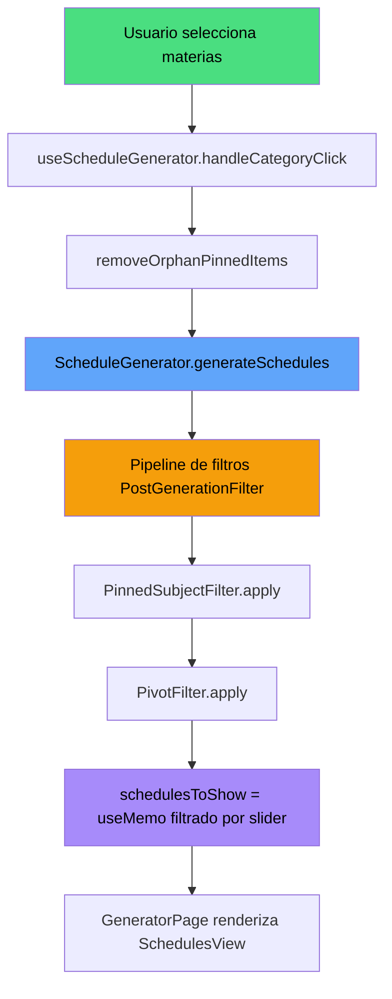
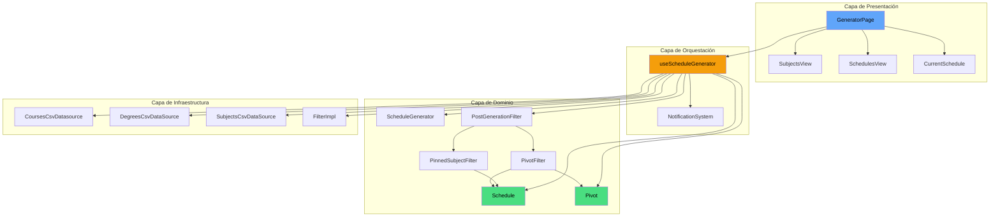

**Código:** DOC-DOS-02  
**Versión:** 1.0  
**Relacionado con:** MR-6  
**Equipo Asignado:** Alfa  
**Analista Principal:** Rodrigo Joaquín Pacab Canul  
**Analista Revisor (Par):** Ricardo Palma

---

## 1. Ideación y Fundamentación Teórica

**Patrón de Diseño GoF Aplicado:** Strategy + Facade

*Justificación:* El sistema ya emplea el patrón Strategy para el filtrado de cursos (`CourseFilter` con `DegreeFilter`, `SubjectFilter`, etc.). Extender este patrón a los filtros de post-generación (materias fijadas y pivotes) mantiene la consistencia arquitectónica. Cada filtro de post-generación (`PinnedSubjectFilter`, `PivotFilter`) implementará una interfaz común (`PostGenerationFilter`), permitiendo agregar nuevos filtros sin modificar la lógica existente (OCP). El hook `useScheduleGenerator` actúa como Facade, ocultando la complejidad de orquestación detrás de una interfaz simplificada para la vista.

**Principio de Diseño (SOLID) Priorizado:** SRP (Single Responsibility Principle)

*Justificación:* `GeneratorPage` (WMC=31, NAssoc=15) viola SRP al mezclar lógica de dominio, gestión de estado y presentación. La refactorización distribuye responsabilidades: (1) `Schedule` y `Pivot` encapsulan lógica de negocio, (2) `useScheduleGenerator` orquesta estado y servicios, (3) `GeneratorPage` solo renderiza. Adicionalmente se aplica OCP al convertir filtros de post-generación en clases extensibles y DIP al depender de abstracciones (`PostGenerationFilter`) en lugar de funciones inline.

**Técnica Algorítmica / Complejidad Esperada (Big-O):** Filtrado Lineal O(n·m)

*Justificación:* El filtrado de post-generación itera sobre n horarios verificando m condiciones (materias fijadas y pivotes). Cada horario se evalúa en O(c) donde c es la cantidad de cursos, resultando en O(n·m·c). Este es el mínimo teórico dado que cada horario debe verificarse al menos una vez. La derivación reactiva de `schedulesToShow` con `useMemo` elimina el `useEffect` de sincronización, reduciendo re-renderizados de O(k²) a O(k) donde k es el número de actualizaciones de estado. El agrupamiento de pivotes por materia en `hasPivots` reduce consultas redundantes usando un `Map` de acceso O(1).

---

## 2. Diseño Técnico y Métricas

### Diagrama de Clases — Arquitectura Refactorizada



### Diagrama de Flujo — Pipeline de Post-Generación Refactorizado



### Diagrama de Flujo — Derivación Reactiva (useMemo vs useEffect)

```mermaid
flowchart LR
    subgraph Antes — useEffect manual
        A1[generatedSchedules cambia] --> A2[useEffect#1 detecta cambio]
        A2 --> A3[setState schedulesToShow]
        A3 --> A4[Re-render innecesario]
    end

    subgraph Despues — useMemo reactivo
        B1[generatedSchedules cambia] --> B2[schedulesToShow = useMemo calcula derivación]
        B2 --> B3[Sin re-render extra]
    end

    style A4 fill:#f87171,color:#000
    style B3 fill:#4ade80,color:#000
```

### Diagrama de Componentes — Arquitectura por Capas (Refactorizada)



### Métricas Estructurales de la Propuesta

| Métrica | Clase | Valor Actual | Valor Propuesto | Interpretación (Manual OO) | Límite | Estado |
| :--- | :--- | :---: | :---: | :--- | :---: | :---: |
| **WMC** | GeneratorPage | 31 | ≤ 20 | Reducción por extracción de lógica a hook y dominio | ≤ 20 | ✓ |
| **WMC** | useScheduleGenerator | N/A | ~18 | Orquestación de estado y servicios, dentro de rango aceptable | ≤ 20 | ✓ |
| **WMC** | Schedule | ~15 | 18 | Incremento por dos nuevos métodos de dominio, rango bajo | ≤ 20 | ✓ |
| **WMC** | Pivot | 0 (interfaz) | 3 | Conversión a clase con constructor y métodos simples | ≤ 20 | ✓ |
| **WMC** | PinnedSubjectFilter | N/A | 2 | Método `apply` simple con filtrado lineal | ≤ 20 | ✓ |
| **WMC** | PivotFilter | N/A | 3 | Método `apply` con filtrado y agrupación | ≤ 20 | ✓ |
| **RFC** | GeneratorPage | ~40 | ~12 | Reducción drástica: solo presentación y hook | ≤ 50 | ✓ |
| **RFC** | useScheduleGenerator | N/A | ~25 | Orquesta dominio e infraestructura | ≤ 50 | ✓ |
| **NAssoc** | GeneratorPage | 15 | ≤ 5 | Solo widgets de presentación y hook | ≤ 5 | ✓ |
| **NAssoc** | useScheduleGenerator | N/A | ~8 | Asociaciones con dominio e infraestructura | — | Aceptable |
| **DIT** | Schedule | 0 | 0 | Sin herencia | ≤ 5 | ✓ |
| **DIT** | Pivot | 0 | 0 | Clase sin herencia | ≤ 5 | ✓ |
| **LCOM\*** | GeneratorPage | ~0.75 | ~0.30 | Reducción: componente cohesivo de solo presentación | ≤ 0.60 | ✓ |

### Propuesta de Código (Snippets en TypeScript)

#### Snippet 1: `Pivot.ts` — Conversión de interfaz a clase

```typescript
export class Pivot {
    constructor(
        public readonly idSubject: number,
        public readonly idProfessor: number
    ) {}

    belongsTo(subjectId: number): boolean {
        return this.idSubject === subjectId;
    }

    static create(idSubject: number, idProfessor: number): Pivot {
        return new Pivot(idSubject, idProfessor);
    }
}
```

#### Snippet 2: `Schedule.ts` — Métodos de dominio añadidos

```typescript
public hasAllPinnedSubjects(pinnedSubjectIds: number[]): boolean {
    if (pinnedSubjectIds.length === 0) return true;
    return pinnedSubjectIds.every(subjectId =>
        this._courses.some(course => course.subject.id === subjectId)
    );
}

public hasPivots(pivots: Pivot[]): boolean {
    if (pivots.length === 0) return true;
    const pivotsBySubject = new Map<number, number[]>();
    for (const pivot of pivots) {
        const existing = pivotsBySubject.get(pivot.idSubject) ?? [];
        existing.push(pivot.idProfessor);
        pivotsBySubject.set(pivot.idSubject, existing);
    }
    for (const [subjectId, professorIds] of pivotsBySubject) {
        const courseForSubject = this._courses.find(
            course => course.subject.id === subjectId
        );
        if (courseForSubject && !professorIds.includes(courseForSubject.professor.id)) {
            return false;
        }
    }
    return true;
}
```

#### Snippet 3: `PostGenerationFilter` — Interfaz Strategy

```typescript
import { Schedule } from "./Schedule";

export interface PostGenerationFilter {
    apply(schedules: Schedule[]): Schedule[];
}
```

#### Snippet 4: `PinnedSubjectFilter.ts` — Implementación concreta

```typescript
import { Schedule } from "./Schedule";
import { PostGenerationFilter } from "./PostGenerationFilter";

export class PinnedSubjectFilter implements PostGenerationFilter {
    constructor(private readonly pinnedSubjectIds: number[]) {}

    apply(schedules: Schedule[]): Schedule[] {
        if (this.pinnedSubjectIds.length === 0) return schedules;
        return schedules.filter(schedule =>
            schedule.hasAllPinnedSubjects(this.pinnedSubjectIds)
        );
    }
}
```

#### Snippet 5: `PivotFilter.ts` — Implementación concreta

```typescript
import { Schedule } from "./Schedule";
import { PostGenerationFilter } from "./PostGenerationFilter";
import { Pivot } from "./Pivot";

export class PivotFilter implements PostGenerationFilter {
    constructor(private readonly pivots: Pivot[]) {}

    apply(schedules: Schedule[]): Schedule[] {
        if (this.pivots.length === 0) return schedules;
        return schedules.filter(schedule => schedule.hasPivots(this.pivots));
    }
}
```

#### Snippet 6: `useScheduleGenerator.ts` — Hook de orquestación (esqueleto)

```typescript
import { useState, useCallback, useMemo } from "react";
import { Schedule } from "@/domain/entities/Schedule";
import { ScheduleGenerator } from "@/domain/entities/ScheduleGenerator";
import { Pivot } from "@/domain/entities/Pivot";
import { Category } from "@/domain/entities/Category";
import { SubjectCategory } from "@/domain/entities/SubjectCategory";
import { CoursesCsvDatasource } from "@/infrastructure/datasource/CoursesCsvDatasource";
import { DegreesCsvDataSource } from "@/infrastructure/datasource/DegreesCsvDataSource";
import { SubjectsCsvDataSource } from "@/infrastructure/datasource/SubjectsCSvDataSource";
import { FilterImpl } from "@/infrastructure/datasource/FilterImpl";
import { PinnedSubjectFilter } from "@/domain/entities/PinnedSubjectFilter";
import { { PivotFilter } from "@/domain/entities/PivotFilter";

interface NotificationState {
    message: string;
    visible: boolean;
}

interface UseScheduleGeneratorReturn {
    generatedSchedules: Schedule[];
    schedulesToShow: Schedule[];
    currentCategories: Category[];
    pivots: Pivot[];
    setPivots: React.Dispatch<React.SetStateAction<Pivot[]>>;
    pinnedSubjects: number[];
    setPinnedSubjects: React.Dispatch<React.SetStateAction<number[]>>;
    notification: NotificationState;
    isFilterCoursesEmpty: boolean;
    generateSchedules: (categories: Category[]) => Promise<void>;
    handleCategoryClick: (categories: Category[]) => void;
    handleRemoveSubject: (categoryIndex: number, subjectId: number) => void;
    selectedSubjectsCount: number | number[];
    setSelectedSubjectsCount: React.Dispatch<React.SetStateAction<number | number[]>>;
    maxSubjectsCount: number;
    defaultSubjectsCount: number;
    page: number;
    setPage: React.Dispatch<React.SetStateAction<number>>;
}

export function useScheduleGenerator(): UseScheduleGeneratorReturn {
    const [generatedSchedules, setGeneratedSchedules] = useState<Schedule[]>([]);
    const [currentCategories, setCurrentCategories] = useState<Category[]>([]);
    const [pivots, setPivots] = useState<Pivot[]>([]);
    const [pinnedSubjects, setPinnedSubjects] = useState<number[]>([]);
    const [isFilterCoursesEmpty, setIsFilterCoursesEmpty] = useState(false);
    const [selectedSubjectsCount, setSelectedSubjectsCount] = useState<number | number[]>(0);
    const [maxSubjectsCount, setMaxSubjectsCount] = useState(0);
    const [defaultSubjectsCount, setDefaultSubjectsCount] = useState(0);
    const [page, setPage] = useState(0);
    const [notification, setNotification] = useState<NotificationState>({
        message: "",
        visible: false
    });

    const showNotification = useCallback((message: string, duration: number = 3000) => {
        setNotification({ message, visible: true });
        setTimeout(() => setNotification({ message: "", visible: false }), duration);
    }, []);

    const schedulesToShow = useMemo(() => {
        if (typeof selectedSubjectsCount === "number" && selectedSubjectsCount > 0) {
            return generatedSchedules.filter(
                gs => gs.courses.length === selectedSubjectsCount
            );
        }
        return generatedSchedules;
    }, [generatedSchedules, selectedSubjectsCount]);

    const removeOrphanPinnedItems = useCallback((categories: Category[]): {
        cleanPinnedSubjects: number[];
        cleanPivots: Pivot[];
    } => {
        const semestersWithSubjectsSelected = categories.filter(
            c => c instanceof SubjectCategory
        );
        const selectedSubjectIds = semestersWithSubjectsSelected.flatMap(
            s => s.selectedValues.flatMap(sv => (sv as { id: number }).id)
        );
        return {
            cleanPinnedSubjects: pinnedSubjects.filter(id =>
                selectedSubjectIds.includes(id)
            ),
            cleanPivots: pivots.filter(p =>
                selectedSubjectIds.includes(p.idSubject)
            )
        };
    }, [pinnedSubjects, pivots]);

    const generateSchedules = useCallback(async (categories: Category[]) => {
        setPage(0);
        showNotification("Generando horarios...");

        const data = new CoursesCsvDatasource();
        const filter = new FilterImpl(categories.map(c => c.toCourseFilter()));
        const courses = await data.getCoursesByFilter(filter);

        if (courses.length === 0) {
            setGeneratedSchedules([]);
            setIsFilterCoursesEmpty(true);
            setNotification({ message: "", visible: false });
            return;
        }

        const generator = new ScheduleGenerator();
        const schedules = generator.generateSchedules(courses);

        const pipeline: PostGenerationFilter[] = [
            new PinnedSubjectFilter(pinnedSubjects),
            new PivotFilter(pivots)
        ];

        const filtered = pipeline.reduce(
            (result, filter) => filter.apply(result),
            schedules
        );

        const sorted = filtered.sort((a, b) => b.courses.length - a.courses.length);
        const maxCourses = sorted.length > 0
            ? Math.max(...sorted.map(s => s.courses.length))
            : 0;

        setDefaultSubjectsCount(maxCourses);
        setGeneratedSchedules(sorted);
        showNotification(`${sorted.length} Horarios Generados!`);
    }, [pinnedSubjects, pivots]);

    const handleCategoryClick = useCallback((categories: Category[]) => {
        setCurrentCategories(categories);
        const { cleanPinnedSubjects, cleanPivots } = removeOrphanPinnedItems(categories);
        setPinnedSubjects(cleanPinnedSubjects);
        setPivots(cleanPivots);

        const semestersWithSubjectsSelected = categories.filter(
            c => c instanceof SubjectCategory
        );
        let count = 0;
        semestersWithSubjectsSelected.forEach(c => {
            count += c.selectedValues.length;
        });
        setMaxSubjectsCount(count);
    }, [removeOrphanPinnedItems]);

    const handleRemoveSubject = useCallback((categoryIndex: number, subjectId: number) => {
        const newCategories = [...currentCategories];
        const category = newCategories[categoryIndex];
        category.onClick(subjectId);
        newCategories[categoryIndex] = category;
        currentCategories.forEach(cat => cat.filterWithCategories(newCategories));
        handleCategoryClick(newCategories);
    }, [currentCategories, handleCategoryClick]);

    return {
        generatedSchedules,
        schedulesToShow,
        currentCategories,
        pivots,
        setPivots,
        pinnedSubjects,
        setPinnedSubjects,
        notification,
        isFilterCoursesEmpty,
        generateSchedules,
        handleCategoryClick,
        handleRemoveSubject,
        selectedSubjectsCount,
        setSelectedSubjectsCount,
        maxSubjectsCount,
        defaultSubjectsCount,
        page,
        setPage
    };
}
```

#### Snippet 7: `GeneratorPage` refactorizado (esqueleto)

```typescript
"use client";

import { useScheduleGenerator } from "@/app/hooks/useScheduleGenerator";
import SchedulesView from "../widgets/SchedulesView";
import SubjectsView from "../widgets/SubjectsView";
import CurrentSchedule from "../widgets/CurrentSchedule";
import { useState, useEffect } from "react";

const GeneratorPage = () => {
    const [indexSelected, setIndexSelected] = useState(0);
    const [isSideBarOpen, setIsSideBarOpen] = useState(false);
    const [dayFormat, setDayFormat] = useState<"short" | "long">("long");
    const [showConflicts, setShowConflicts] = useState(false);

    const {
        schedulesToShow,
        currentCategories,
        pivots,
        setPivots,
        pinnedSubjects,
        setPinnedSubjects,
        notification,
        isFilterCoursesEmpty,
        handleCategoryClick,
        handleRemoveSubject,
        maxSubjectsCount,
        defaultSubjectsCount,
        selectedSubjectsCount,
        setSelectedSubjectsCount,
        page,
        setPage
    } = useScheduleGenerator();

    useEffect(() => {
        if (isFilterCoursesEmpty) {
            alert("No hay cursos disponibles con los filtros seleccionados");
        }
    }, [isFilterCoursesEmpty]);

    useEffect(() => {
        const handleResize = () => {
            setDayFormat(window.innerWidth > 640 ? "long" : "short");
        };
        window.addEventListener("resize", handleResize);
        handleResize();
        return () => window.removeEventListener("resize", handleResize);
    }, []);

    const toggleSideBar = () => setIsSideBarOpen(prev => !prev);
    const handleSwitchView = (index: number) => setIndexSelected(index);

    return (
        <div className="flex flex-1 flex-col overflow-auto">
            {notification.visible && (
                <div className="fixed bottom-20 left-1/2 transform -translate-x-1/2 z-50
                    bg-purple-600 text-white px-6 py-3 rounded-lg shadow-lg animate-fade-in">
                    {notification.message}
                </div>
            )}
            <div className="flex flex-col flex-1 overflow-auto relative">
                {dayFormat === "long" ? (
                    <div className="flex flex-row h-full">
                        <div className="w-[25%] md:dark:bg-gray-950 md:bg-gray-100
                            md:border-r md:border-gray-300 dark:border-none">
                            <SubjectsView
                                pivots={pivots}
                                setPivots={setPivots}
                                toggleSideBar={toggleSideBar}
                                isSideBarOpen={isSideBarOpen}
                                currentCategories={currentCategories}
                                handleClickFilter={handleCategoryClick}
                                pinnedSubjects={pinnedSubjects}
                                setPinnedSubjects={setPinnedSubjects}
                                onRemoveSubject={handleRemoveSubject}
                            />
                        </div>
                        <div className="w-[50%]">
                            <SchedulesView
                                schedulesToShow={schedulesToShow}
                                dayFormat={dayFormat}
                                onChangeSchedulePage={setPage}
                                page={page}
                                maxSubjectsCount={maxSubjectsCount}
                                defaultSubjectsCount={defaultSubjectsCount}
                                handleSliderChange={setSelectedSubjectsCount}
                                showConflicts={showConflicts}
                            />
                        </div>
                        <div className="w-[25%]">
                            <CurrentSchedule
                                schedule={schedulesToShow[page]}
                                pinnedSubjects={pinnedSubjects}
                                pivots={pivots}
                                label={`Horario ${page + 1}/${schedulesToShow.length}`}
                                showConflicts={showConflicts}
                                setShowConflicts={setShowConflicts}
                            />
                        </div>
                    </div>
                ) : (
                    <>
                        <div className="flex-1"
                            style={{ display: indexSelected === 0 ? "block" : "none" }}>
                            <SubjectsView
                                pivots={pivots}
                                setPivots={setPivots}
                                toggleSideBar={toggleSideBar}
                                isSideBarOpen={isSideBarOpen}
                                currentCategories={currentCategories}
                                handleClickFilter={handleCategoryClick}
                                pinnedSubjects={pinnedSubjects}
                                setPinnedSubjects={setPinnedSubjects}
                                onRemoveSubject={handleRemoveSubject}
                            />
                        </div>
                        <div style={{ display: indexSelected === 0 ? "none" : "block" }}>
                            <SchedulesView
                                schedulesToShow={schedulesToShow}
                                dayFormat={dayFormat}
                                onChangeSchedulePage={setPage}
                                page={page}
                                maxSubjectsCount={maxSubjectsCount}
                                defaultSubjectsCount={defaultSubjectsCount}
                                handleSliderChange={setSelectedSubjectsCount}
                                showConflicts={showConflicts}
                            />
                            <CurrentSchedule
                                schedule={schedulesToShow[page]}
                                pinnedSubjects={pinnedSubjects}
                                pivots={pivots}
                                label={`Horario ${page + 1}/${schedulesToShow.length}`}
                                showConflicts={showConflicts}
                                setShowConflicts={setShowConflicts}
                            />
                        </div>
                    </>
                )}
            </div>
            <div className="p-2 gap-3 flex flex-row justify-center z-20
                dark:bg-gray-900 bg-white fixed bottom-0 self-center w-full md:hidden"
                style={{ boxShadow: "0px 6px 10px black" }}>
                <ButtonSwitchView index={0} isSelected={indexSelected === 0}
                    label="Materias" onClick={handleSwitchView} />
                <ButtonSwitchView index={1} isSelected={indexSelected === 1}
                    label="Horarios" onClick={handleSwitchView} />
            </div>
        </div>
    );
};

export default GeneratorPage;
```

---

## 3. Historial de Pivotes (Sad Path / Alternativas Descartadas)

**Enfoque Inicial Intentado:**

Se consideró mover la lógica de `withPinnedSubjects` y `scheduleHasPivots` a un servicio `ScheduleFilterService` independiente (patrón Service) en lugar de incorporar los métodos directamente en la entidad `Schedule`.

**Motivo Técnico del Rechazo:**

Colocar métodos de validación de horarios (`hasAllPinnedSubjects`, `hasPivots`) en un servicio externo viola el principio de *Tell, Don't Ask*: la lógica de "¿este horario cumple con las materias fijadas?" y "¿este horario cumple con los pivotes?" pertenece intrínsecamente a la entidad `Schedule`, ya que son preguntas sobre el estado interno del horario. Un servicio externo tendría que acceder a los cursos del horario desde afuera, creando acoplamiento innecesario y violando la encapsulación. Además, las métricas de WMC de `Schedule` permanecen dentro del rango aceptable (18 ≤ 20), por lo que no existe justificación métrica para mantener esta lógica fuera de la entidad.

**Decisión:** Se pivotó a la solución actual donde los métodos se agregan directamente a `Schedule`, cumpliendo SRP sin sacrificar cohesión.

---

## 4. Estimación de Esfuerzo y Riesgos Internos

**Esfuerzo Estimado (Puntos Fibonacci):** [8] Puntos

*Justificación del esfuerzo:* La refactorización toca múltiples capas (dominio, infraestructura, presentación) y componentes interrelacionados. Los cambios en `Schedule` y `Pivot` son sencillos (2 puntos), pero la creación de `useScheduleGenerator`, los filtros de post-generación y la refactorización completa de `GeneratorPage` requieren coordinación cuidadosa de estado y pruebas de regresión (6 puntos). Se abarcan los 6 requisitos del DER más los 2 no funcionales.

**Cálculo de Riesgo Técnico (NVR):**

* Probabilidad [2] × Impacto [2] = **[4]** → Riesgo medio-bajo

*Probabilidad 2 (Posible):* Existe riesgo de que la migración de estado de `GeneratorPage` al hook introduzca bugs sutiles de sincronización, especialmente con los efectos de auto-generación y la cascada de filtros dinámicos. Los 14 estados actuales y 5 `useEffect` crean un mapa de dependencias complejo.

*Impacto 2 (Impacto medio):* Un error en la migración afectaría directamente la funcionalidad principal del generador de horarios (RF-029 a RF-044), pero los requisitos tienen trazabilidad clara y los tests unitarios existentes sirven como red de seguridad.

**Estrategia de Mitigación:**

1. Ejecutar los tests unitarios existentes (`npm run test`) antes y después de cada cambio incremental para detectar regresiones.
2. Aplicar los cambios en orden de dependencia: primero `Pivot` y `Schedule` (dominio), luego filtros (`PostGenerationFilter`, `PinnedSubjectFilter`, `PivotFilter`), luego `useScheduleGenerator` (orquestación), y finalmente `GeneratorPage` (presentación).
3. Mantener el archivo original `page.tsx` como referencia hasta validar que el comportamiento es idéntico tras la refactorización.
4. Para RF-MR6-3 (eliminación de `useEffect` de sincronización): verificar manualmente que el slider de materias filtra correctamente los horarios en tiempo real sin re-renderizados innecesarios.

---

## 5. Resolución Formal

**[ ] Aprobado.**

**[ ] Aprobado con condiciones.**

* Especificar restricciones, acciones obligatorias o cambios requeridos

**[ ] Rechazado**

* Motivo(s) de rechazo

**Comentarios del Líder Técnico / Motivo de decisión: _____________________________**